# 机体架构设计（EVA）

> 本文基于当前代码与文档整理，面向研发与维护人员，给出 EVA 的整体架构、关键模块、数据/控制流与可扩展点说明。
> 代码参考：`src/widget/*`、`src/xnet.*`、`src/xtool.*`、`src/xbackend.*`、`src/utils/*`、`src/skill/*`、`src/net/*`。

---

## 1. 架构总览

EVA 是一个“前端驱动 + 工具协作 + 本地/远端推理兼容”的桌面智能体系统。核心由四大类构成：**net / widget / tool / expend**，并通过约定框架（data framework）驱动模型工具协作。

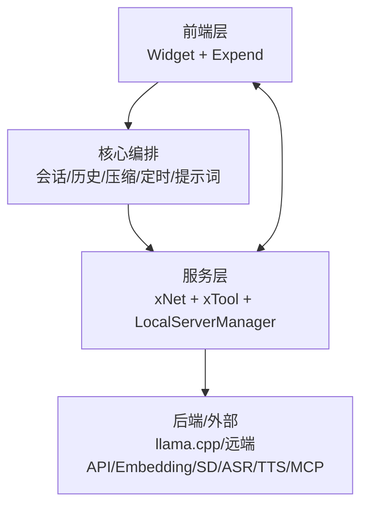

### 1.1 关键子系统拆解图（突出主链路）
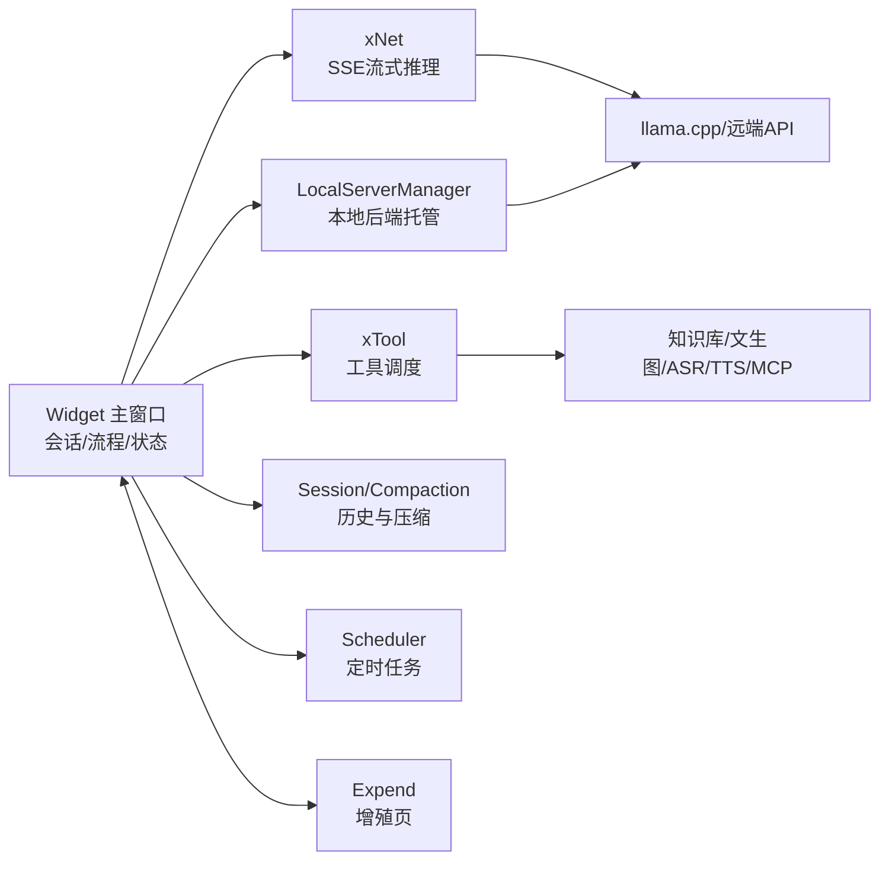

---

## 2. 模块职责与文件位置

| 模块 | 主要职责 | 关键文件 |
| --- | --- | --- |
| **Widget** | 会话流程、UI 状态机、工具链路编排、记录条/输出渲染 | `src/widget/widget.*`、`src/widget/widget_*` |
| **Expend** | 增殖功能窗口（知识库/文生图/ASR/TTS/定时任务等） | `src/expend/*` |
| **xNet** | HTTP 请求 + SSE 流式解析；输出/计数回传 | `src/xnet.*` |
| **xTool** | 工具执行与调度、系统工程师工具、MCP转接、桌面控制 | `src/xtool.*` |
| **LocalServerManager** | 本地 llama.cpp server 启停与参数管理 | `src/xbackend.*` |
| **LocalProxy** | 本地端口代理与后端懒唤醒 | `src/net/localproxy.*` |
| **ControlChannel** | 控制端/宿主机双向通道（TCP JSON 帧） | `src/net/controlchannel.*` |
| **Prompt / Tool Schema** | 系统提示词、工具描述与多语种模板 | `src/prompt.*` |
| **HistoryStore** | 会话持久化（meta.json + messages.jsonl） | `src/utils/history_store.*` |
| **Compaction** | 上下文压缩与摘要落盘 | `src/widget/widget_session.cpp` |
| **Scheduler** | 定时任务、cron 解析、倒计时与触发 | `src/utils/scheduler_service.*` |
| **SkillManager** | 技能包加载、启用与 prompt 拼装 | `src/skill/skill_manager.*` |
| **xMcp** | MCP 工具清单/调用桥接 | `src/xmcp.*` |

### 2.1 组件依赖图
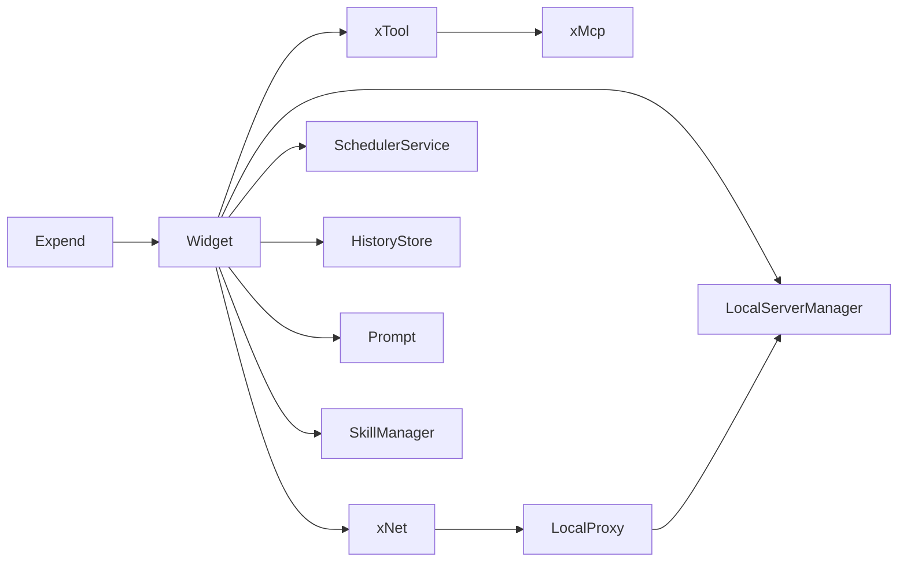

### 2.2 关键类关系图（简化）
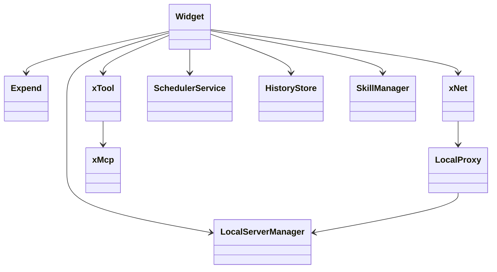

### 2.3 主要信号槽对照表（核心路径）
| 发起方 | 信号 | 目标槽 | 作用 |
| --- | --- | --- | --- |
| Widget | `ui2net_push` | `xNet::run` | 发起推理请求 |
| xNet | `net2ui_output` | `Widget::reflash_output` | 流式输出 |
| xNet | `net2ui_pushover` | `Widget::recv_pushover` | 回合结束 |
| Widget | `ui2tool_exec` | `xTool::Exec` | 执行工具 |
| xTool | `tool2ui_pushover` | `Widget::recv_toolpushover` | 工具结果回写 |
| Widget | `ui2expend_schedule_jobs` | `Expend::recv_schedule_jobs` | 刷新定时任务列表 |
| Expend | `expend2ui_scheduleAction` | `Widget::recv_schedule_action` | 定时任务操作 |

---

## 3. 线程与进程模型

主线程负责 UI；网络、工具、MCP 等在独立线程；本地后端为独立进程（llama.cpp server）。

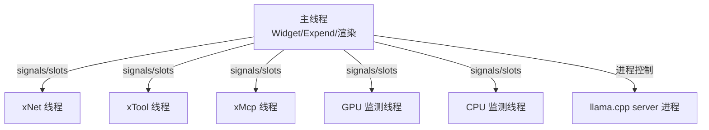

> 线程创建与连接位于 `src/main.cpp`，xNet/xTool/xMcp 均通过 `moveToThread()` 运行。

### 3.1 运行时状态机（简化）
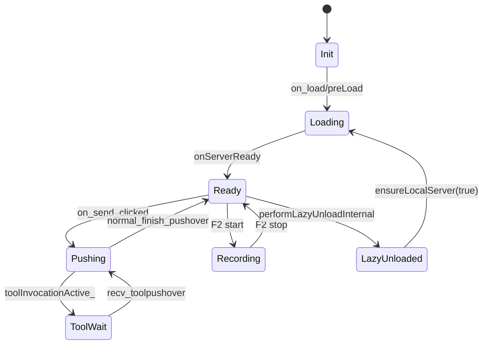

---

## 4. 关键数据结构

| 名称 | 说明 | 位置 |
| --- | --- | --- |
| `ui_messagesArray` | 当前会话消息数组（OpenAI 兼容） | `widget_session.cpp` |
| `HistoryStore` | 会话持久化，`meta.json + messages.jsonl` | `utils/history_store.*` |
| `RecordRole / recordEntries_` | 记录条数据模型（含压缩角色） | `utils/recordbar.*` + `widget_records.cpp` |
| `COMPACTION_SETTINGS` | 压缩阈值、保留尾部、摘要限制等 | `xconfig.h` |
| `SCHEDULER_SETTINGS` | 定时任务刷新间隔与 cron lookahead | `xconfig.h` |
| `tools_call / tool_result` | 工具解析与回传缓存 | `widget_toolflow.cpp` |

---

## 5. 关键流程（图表）

### 5.1 装载流程（本地/链接）
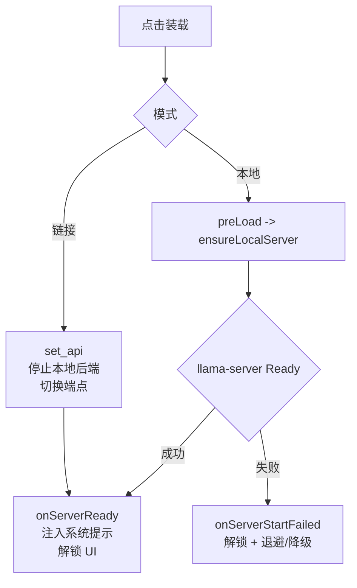

### 5.2 对话 + 工具循环
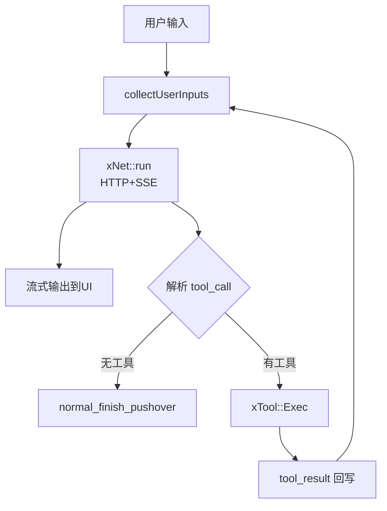

### 5.3 上下文压缩（Compaction）
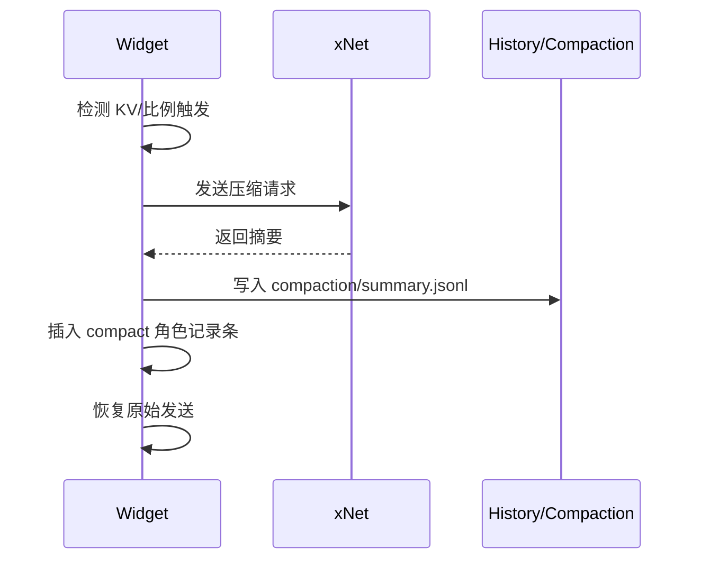

### 5.4 定时任务（Scheduler）
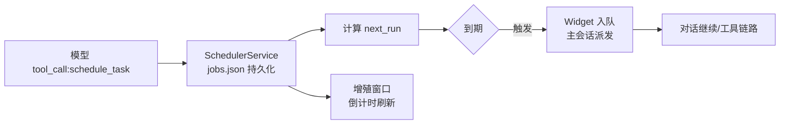

---

## 6. 持久化与目录结构

系统主要持久化目录为 `EVA_TEMP`，并按功能拆分子目录：

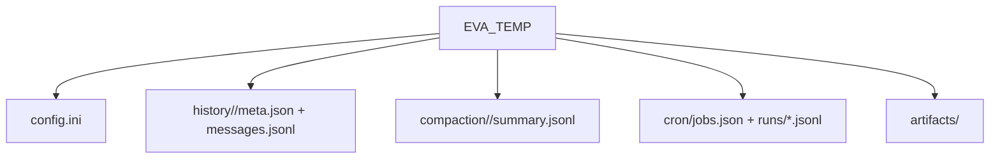

**其他固定目录：**

| 目录 | 作用 |
| --- | --- |
| `EVA_BACKEND` | 本地后端程序与依赖（按架构/系统/设备划分） |
| `EVA_MODELS` | 模型目录（llm/embedding/text2image/speech2text/text2speech） |
| `EVA_SKILLS` | 技能包目录（SkillManager 扫描） |
| `EVA_WORK` | 工程师工具默认工作目录 |

---

## 7. 工具系统与约定框架

### 7.1 工具类型
EVA 默认工具体系由 xTool 统一路由，包含：
- 计算器、知识库、文生图、系统工程师工具、桌面控制器、MCP 工具、定时任务工具等。
- `tool_call` 与 `function_call` 两种解析路径（当前默认 `tool_call`）。
- 工程师工具支持 Docker 沙盒（见 `utils/docker_sandbox.*`）。

### 7.2 约定框架（Data Framework）
核心机制：**系统提示词 + 工具 schema + 输出解析器**，通过 `<tool_call>{name,arguments}</tool_call>` 约束模型输出，再由 Widget/xTool 执行并回写。

关键入口：
- Prompt 组装：`prompt.cpp` / `prompt_builder.cpp`
- 工具描述与 schema：`prompt.cpp` 中 `TOOLS_INFO`
- 工具回传：`Widget::recv_toolpushover` → `handleToolLoop`

---

## 8. 增殖窗口（Expend）与扩展点

增殖窗口提供“与主对话并行”的扩展能力，典型子页：
- 知识库构建/检索（Embedding 服务 + VectorDB）
- 文生图（Stable Diffusion/Flux）
- 声转文/文转声（Whisper/tts.cpp）
- 定时任务管理（列表/倒计时/详情）
- MCP 管理、模型量化、模型评估等

**扩展方式**：
1) 新增工具：补充 `prompt.cpp` schema + `xTool` 执行 + Widget 解析。  
2) 新增增殖页面：`src/expend/expend.ui` + `expend_*.cpp`。  
3) 新增技能：放入 `EVA_SKILLS`，由 SkillManager 加载与注入提示词。  

---

## 9. 可靠性与可运维性

| 机制 | 说明 | 位置 |
| --- | --- | --- |
| 懒唤醒/懒卸载 | LocalProxy 维持端口，闲置卸载后端 | `net/localproxy.*` |
| 流程打点 | FlowTracer 记录关键阶段 | `utils/flowtracer.*` |
| 崩溃保护 | LocalServerManager 识别启动失败并解锁 UI | `xbackend.*` |
| 持久化 | History/Compaction/Cron 落盘 | `utils/history_store.*` / `widget_session.cpp` / `scheduler_service.*` |
| 容器沙盒 | 工程师工具隔离执行 | `utils/docker_sandbox.*` |

---

## 10. 未来扩展建议（与现有架构兼容）

1) **WorkflowRunner + Queue**：把长链路任务拆步并持久化，结合调度/断点恢复。  
2) **统一事件总线**：将 net/tool/compaction/scheduler 的状态统一聚合为可视化事件流。  
3) **Memory/Long-term Store**：在 compaction 之前引入“记忆刷新”机制，沉淀长期偏好。  

---

## 11. 文件入口索引

| 入口 | 说明 |
| --- | --- |
| `src/main.cpp` | 线程与信号连接总入口 |
| `src/widget/widget.cpp` | UI 初始化与事件入口 |
| `src/widget/widget_session.cpp` | 会话、压缩、历史 |
| `src/widget/widget_toolflow.cpp` | 工具解析与回环 |
| `src/xnet.*` | 网络/SSE |
| `src/xtool.*` | 工具执行 |
| `src/xbackend.*` | 本地后端 |
| `src/utils/*` | 组件库（History/Scheduler/Flow/VectorDB 等） |
