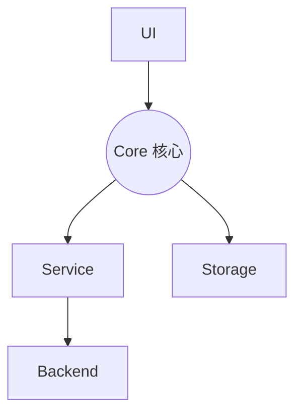
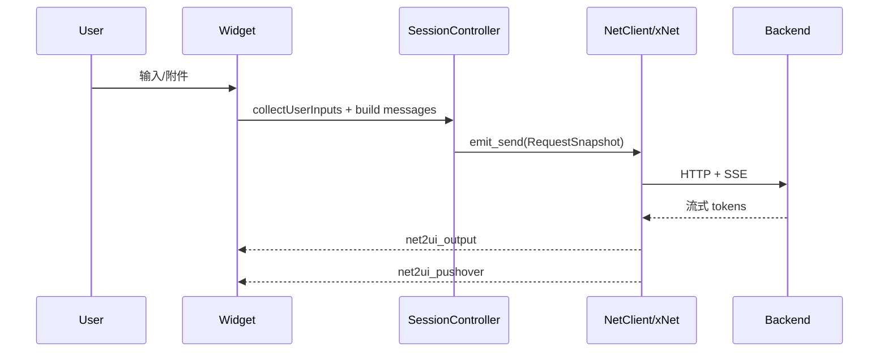
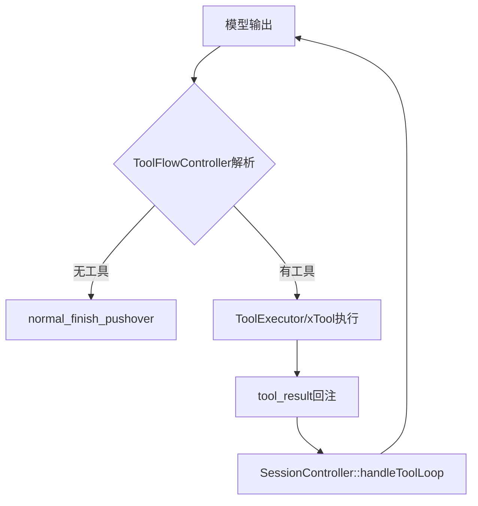
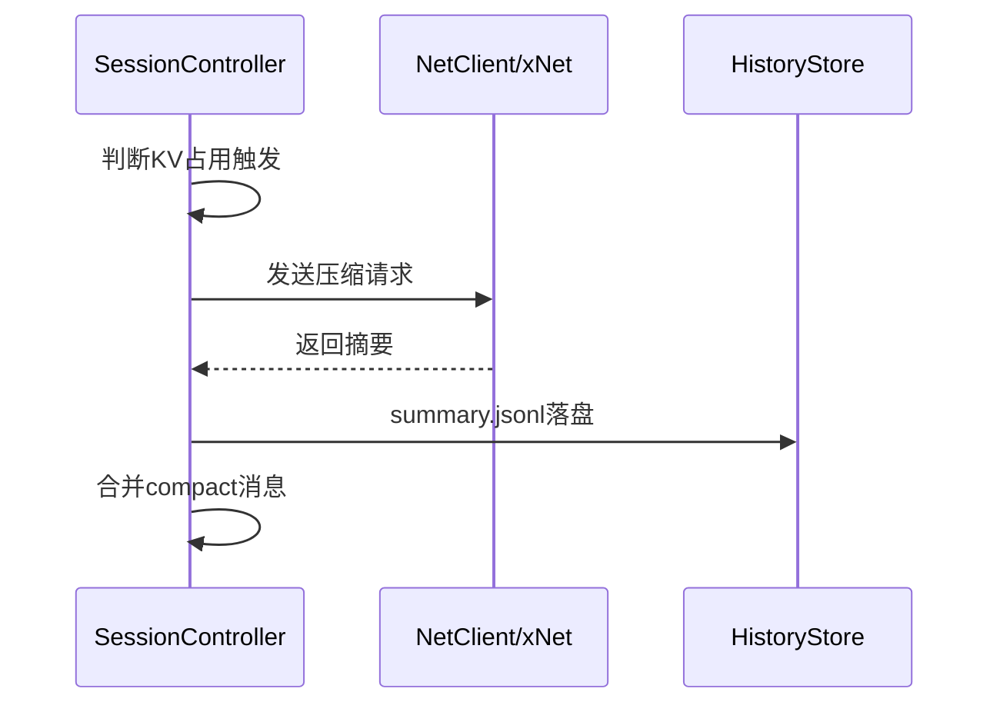
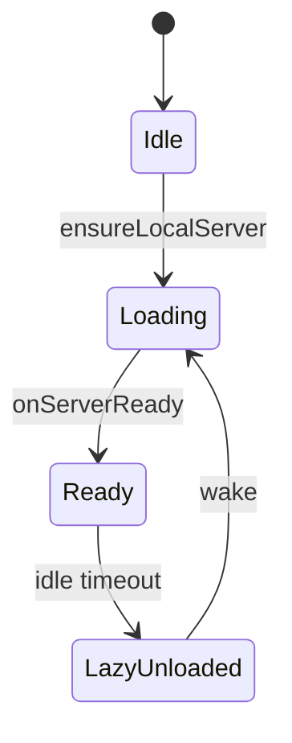
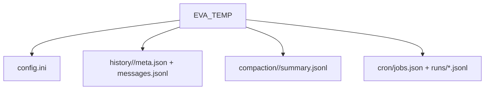
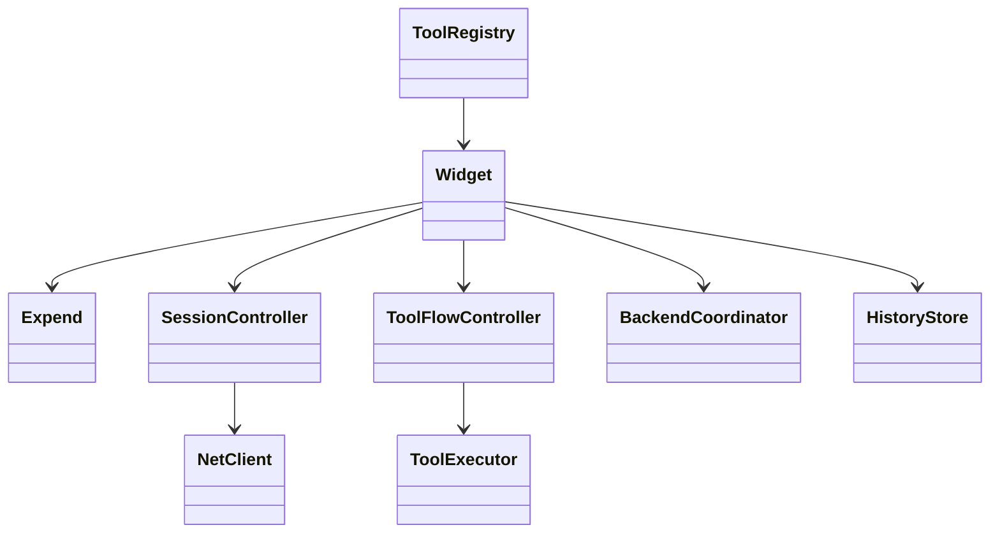

# 机体架构设计（EVA）
> 本文基于当前代码结构整理，面向研发与维护人员，描述 EVA 的总体架构、核心模块、关键数据流与扩展点。
> 代码入口：`src/widget/*`、`src/core/*`、`src/service/*`、`src/storage/*`、`src/xnet.*`、`src/xtool.*`、`src/xmcp.*`、`src/prompt.*`、`src/prompt_builder.*`。
---

## 1. 架构总览
EVA 采用分层架构，**Core 是唯一中枢**，负责把 UI、服务、存储与外部能力连接成闭环：
- **Core（核心）**：会话编排 / 工具回环 / 任务调度 / 压缩。
- **UI**：交互与状态呈现。
- **Service**：网络请求、后端管理、工具执行与注册。
- **Storage**：历史与向量数据。
- **Backend**：本地/远端推理与外部能力。

---

## 2. 模块职责与文件落点
| 模块 | 职责 | 关键文件 |
| --- | --- | --- |
| **Widget** | UI 交互、状态机、输出/记录条渲染、入口编排 | `src/widget/widget.*`、`src/widget/widget_*` |
| **Expend** | 扩展功能面板（知识库/文生图/ASR/TTS/任务） | `src/expend/*` |
| **SessionController** | 会话编排、输入构造、压缩、发送 | `src/core/session/*` |
| **ToolFlowController** | 工具解析、执行回环、工具结果回注 | `src/core/toolflow/*` |
| **NetClient** | 网络请求调度、请求快照发送 | `src/service/net/*` |
| **BackendCoordinator** | 本地后端生命周期与懒卸载/唤醒 | `src/service/backend/backend_coordinator.*` |
| **Local backend** | llama.cpp 进程启动参数/管理 | `src/service/backend/xbackend.*`、`src/service/backend/xbackend_args.*` |
| **LocalProxy** | 本地代理与端口转发 | `src/service/backend/localproxy.*` |
| **ToolExecutor** | 工具执行封装（xTool 代理） | `src/service/tools/tool_executor.*` |
| **ToolRegistry** | 工具 schema & 多语言描述集中维护 | `src/service/tools/tool_registry.*`、`src/prompt.cpp` |
| **xNet** | OpenAI 兼容请求构造与 SSE 解析 | `src/xnet.*` |
| **xTool** | 工具实际执行与回调 | `src/xtool.*` |
| **xMcp** | MCP 工具桥接 | `src/xmcp.*` |
| **HistoryStore** | 会话持久化（meta.json + messages.jsonl） | `src/storage/history_store.*` |
| **VectorDB** | 本地向量检索 | `src/storage/vectordb.*` |
| **Prompt/Builder** | 系统提示词模板 & 消息标准化 | `src/prompt.*`、`src/prompt_builder.*` |

---

## 3. 数据流与控制流
### 3.1 会话发送主链路

### 3.2 工具调用回环

### 3.3 上下文压缩（Compaction）

---

## 4. 会话与消息结构
- `ui_messagesArray`：UI 内部消息队列（含本地扩展字段）。
- `prompt_builder`：将 UI 消息标准化为 OpenAI 兼容格式（移除本地扩展字段）。
- 工具模式：
  - **tool_call（文本）**：模型输出 `<tool_call>{name,arguments}</tool_call>`，工具结果以 `tool` 角色或 `tool_response:` 前缀回注。
  - **function_call（结构化）**：工具由 `tools/tool_calls` 字段触发，工具结果带 `tool_call_id` 回写。

---

## 5. 本地后端生命周期
- **BackendCoordinator** 统一管理本地 llama.cpp server 的启动/停止、懒卸载、唤醒与失败降级。
- **LocalProxy** 负责端口转发与本地/远端切换的平滑过渡。

---

## 6. 线程与进程模型
- UI 主线程：Widget/Expend 渲染与事件处理。
- 工作线程：xNet / xTool / xMcp 通过 `moveToThread()` 分离。
- 本地后端：llama.cpp server 作为外部进程由 BackendCoordinator 管理。

---

## 7. 目录与持久化
- `EVA_TEMP`：配置、历史、压缩摘要、定时任务等中间数据。
- `EVA_BACKEND`：本地后端可执行文件与依赖。
- `EVA_MODELS`：模型目录（llm / embedding / tts / sd 等）。
- `EVA_SKILLS`：技能包目录。
- `EVA_WORK`：工程师工具默认工作目录。

---

## 8. 关键类关系（简化）

---

## 9. 扩展点
1) **新增工具**：
   - 在 `ToolRegistry` 注册 schema + 描述
   - 在 `xTool` 增加执行逻辑
   - 视需要在 UI/Expend 增加开关与提示词拼装

2) **新增扩展页**：
   - `src/expend/expend_*.cpp` + UI 布局
   - 对接 Widget 信号或 ToolExecutor

3) **新增存储**：
   - 统一放入 `src/storage/*` 并由 Widget/Core 调用

---

## 10. 文件入口索引
| 入口 | 说明 |
| --- | --- |
| `src/main.cpp` | 线程创建与对象连线 |
| `src/widget/widget.cpp` | UI 初始化与核心入口 |
| `src/core/session/session_controller.cpp` | 会话编排主入口 |
| `src/core/toolflow/tool_flow_controller.cpp` | 工具回环主入口 |
| `src/service/backend/backend_coordinator.cpp` | 本地后端生命周期 |
| `src/service/net/net_client.cpp` | 统一请求入口 |
| `src/prompt.cpp` / `src/prompt_builder.cpp` | 提示词与消息规范 |
| `src/storage/history_store.cpp` | 历史持久化 |

---

## 11. 设计约束（工程化约定）
- Qt 5.15 / C++17
- QRegularExpression 变量前禁止 `static`（避免旧 CPU 的 PCRE2 JIT SIGILL）
- 统一配置集中在 `xconfig.h`
- 不使用 git 自动提交/分支

---

## 12. 近期架构重构摘要
- 会话与工具回环下沉到 `SessionController` / `ToolFlowController`
- 本地后端逻辑集中到 `BackendCoordinator`
- 工具 schema 集中到 `ToolRegistry`，执行统一走 `ToolExecutor`
- `HistoryStore` / `VectorDB` 归档到 `src/storage/*`
- 网络发送使用 `RequestSnapshot`，避免 UI 状态抖动
