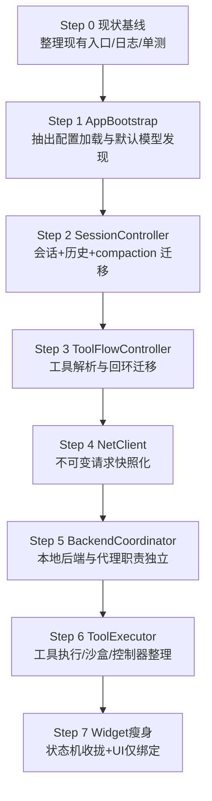

# 机体模块拆分与迁移顺序（草案）

> 目标：在不改变功能体验的前提下，将“上帝类”与跨线程可变状态拆散为清晰模块，降低耦合、提升可维护性与可测性。

---

## 0. 一句话结论
当前架构已具备清晰的“前端/编排/服务/后端”分层，但大量核心流程集中在 `Widget` 与 `main.cpp`。建议按“会话编排 / 工具链 / 网络 / 后端 / 资源”拆分，并用统一状态机与不可变快照取代多组布尔状态，降低线程与职责交叉。

---

## 1. 模块拆分草案

### 1.1 逻辑层级
- **app 启动层**：只负责初始化、配置加载、线程/对象装配。
- **ui 交互层**：仅处理界面显示、用户交互与信号转发。
- **core 编排层**：会话、工具回环、状态机、提示词构建。
- **service 服务层**：网络、后端、MCP、技能、调度等能力提供者。
- **storage 资源层**：持久化、向量库、缓存、历史等。

### 1.2 模块清单与职责（草案）
| 模块 | 主要职责 | 现有文件起点 | 拟迁移目录 | 对外接口草案 |
| --- | --- | --- | --- | --- |
| **AppBootstrap** | 启动/配置迁移/线程装配/默认模型发现 | `src/main.cpp` | `src/app/` | `AppContext build()` |
| **Widget(UI)** | UI 渲染/交互/信号绑定 | `src/widget/*` | `src/ui/` | `WidgetView`(signals/slots) |
| **SessionController** | 会话状态机、历史、KV统计、compaction | `widget_session.cpp` + `history_store.*` | `src/core/session/` | `startTurn()/finishTurn()` |
| **ToolFlowController** | 工具解析/回环/工具结果注入 | `widget_toolflow.cpp` | `src/core/toolflow/` | `handleToolCalls()` |
| **PromptService** | 提示词库与构建 | `prompt.*` + `prompt_builder.*` | `src/core/prompt/` | `buildMessages()` |
| **NetClient** | HTTP/SSE请求与流解析 | `xnet.*` | `src/service/net/` | `send(RequestSnapshot)` |
| **BackendCoordinator** | 本地后端生命周期/端口代理 | `xbackend.*` + `net/localproxy.*` | `src/service/backend/` | `ensureLocalServer()` |
| **McpClient** | MCP 工具拉取/调用 | `xmcp.*` | `src/service/mcp/` | `listTools()/callTool()` |
| **ToolExecutor** | 工具执行、Docker 沙盒、桌面控制器 | `xtool.*` + `utils/docker_sandbox.*` | `src/service/tools/` | `execute(ToolRequest)` |
| **SchedulerService** | 定时任务调度 | `utils/scheduler_service.*` | `src/service/scheduler/` | `schedule()/run()` |
| **SkillService** | 技能加载/注入 | `skill/skill_manager.*` | `src/service/skill/` | `load()/apply()` |
| **Storage** | 历史/向量库/持久化 | `utils/history_store.*` + `utils/vectordb.*` | `src/storage/` | `save/load()` |

> 注：目录名仅为建议，可按当前工程风格调整。

---

## 2. 关键边界与数据模型（建议）

### 2.1 统一快照结构
将跨线程可变字段改为“不可变快照”，避免 UI 直接写 worker 对象的成员变量。
- `AppContext`：应用路径、资源路径、设备与后端解析结果。
- `SettingsSnapshot`：采样参数/后端参数/工具开关（读取后只读）。
- `RequestSnapshot`：一次请求的消息与采样参数（NetClient 仅接收快照）。
- `ToolRequest/ToolResult`：工具调用输入/输出结构化对象。

### 2.2 统一状态机
当前 `Widget` 内存在多组状态布尔（is_run/turnActive_/toolInvocationActive_/compaction*），建议合并为：
- `SessionState`：Idle / Sending / ToolRunning / Compaction / Canceling
- `UiState`：Normal / Loading / Pushing / Recording
并显式列出状态转移表，避免互斥状态同时为 true。

---

## 3. 迁移顺序图（Mermaid）

---

## 4. 迁移步骤说明（建议顺序）

### Step 1：抽离 AppBootstrap
- **目标**：`main.cpp` 仅保留“装配”，复杂初始化下沉。
- **动作**：封装 `ConfigMigrator/DefaultModelFinder`。
- **验收**：启动行为不变，日志一致。

### Step 2：抽离 SessionController
- **目标**：把会话状态、历史持久化、compaction 逻辑从 `Widget` 中移除。
- **动作**：SessionController 接收 UI 信号并返回渲染事件。
- **验收**：聊天/重置/历史恢复无回归。

### Step 3：抽离 ToolFlowController
- **目标**：工具解析与回环专职化。
- **动作**：统一 `tool_call/function_call` 解析入口。
- **验收**：工具循环与记录条显示一致。

### Step 4：NetClient 快照化
- **目标**：避免 UI 线程改写 net 线程成员。
- **动作**：`send(RequestSnapshot)` 替代公开字段。
- **验收**：SSE 输出与 token 统计无回归。

### Step 5：BackendCoordinator
- **目标**：本地后端+代理职责集中化。
- **动作**：`ensureLocalServer()` 与端口回退迁出 Widget。
- **验收**：本地装载/惰性唤醒稳定。

### Step 6：ToolExecutor 整理
- **目标**：工具执行、Docker 沙盒、控制器整合。
- **动作**：收口工具执行入口，统一输出 ToolResult。
- **验收**：工程师工具/控制器/文生图表现一致。

### Step 7：Widget 瘦身
- **目标**：UI 只做显示与交互，逻辑从属 Controller。
- **动作**：合并多组状态布尔为状态机。
- **验收**：UI 状态切换无抖动/锁死。

---

## 4.1 迁移清单（具体类名/文件落点）

> 说明：以下类名/文件落点为建议命名，保持 Qt/C++17 习惯用法；先“加新不删旧”，每一步仅替换一层调用，确保可回滚。

### Step 1：AppBootstrap（启动与配置）
| 新文件 | 类/结构 | 来源迁移 | 备注 |
| --- | --- | --- | --- |
| `src/app/app_context.h` | `struct AppContext` | `main.cpp` 中路径/环境变量/端口信息 | 应用目录、EVA_TEMP、EVA_MODELS、OS/Arch、端口等 |
| `src/app/app_bootstrap.h/.cpp` | `class AppBootstrap` | `main.cpp` 启动序列 | 统一启动入口：`AppContext prepare()` |
| `src/app/config_migrator.h/.cpp` | `class ConfigMigrator` | `main.cpp` 中 QSettings 初始化/迁移 | 统一读写 `eva_config.ini` |
| `src/app/default_model_finder.h/.cpp` | `class DefaultModelFinder` | `main.cpp` 自动发现模型 | 扫描 EVA_MODELS 选最小模型 |
| `src/app/app_resources.h/.cpp` | `class AppResources` | `registerSarasaFontResource/createDesktopShortcut` | 字体资源、快捷方式、QSS 加载 |

**落地动作清单**  
- 从 `src/main.cpp` 迁出：默认模型发现、QSettings 迁移、字体/快捷方式注册。  
- `main.cpp` 保留：`QApplication` 创建、对象装配与 `exec()`。  

### Step 2：SessionController（会话编排）
| 新文件 | 类/结构 | 来源迁移 | 备注 |
| --- | --- | --- | --- |
| `src/core/session/session_state.h` | `enum class SessionState` | `Widget` 内部多布尔状态 | Idle/Sending/ToolRunning/Compaction/Canceling |
| `src/core/session/session_controller.h/.cpp` | `class SessionController` | `widget_session.cpp` 主要逻辑 | 会话入口、KV 统计、历史持久化 |
| `src/core/session/compaction_controller.h/.cpp` | `class CompactionController` | `widget_session.cpp` compaction 逻辑 | 触发/摘要/落盘 |
| `src/core/session/kv_tracker.h/.cpp` | `class KvTracker` | `Widget` KV 统计字段 | 统一 token 统计口径 |
| `src/storage/history_store.h/.cpp` | `class HistoryStore` | `utils/history_store.*` | 归档到 storage 模块 |

**落地动作清单**  
- `Widget` 仅持有 `SessionController` 指针并监听事件。  
- `HistoryStore` 迁移到 `src/storage/` 后更新 include。  

### Step 3：ToolFlowController（工具回环）
| 新文件 | 类/结构 | 来源迁移 | 备注 |
| --- | --- | --- | --- |
| `src/core/toolflow/tool_flow_controller.h/.cpp` | `class ToolFlowController` | `widget_toolflow.cpp` | 解析工具与回环 |
| `src/core/toolflow/tool_call_parser.h/.cpp` | `class ToolCallParser` | `XMLparser` + function_call 解析 | 统一入口 |
| `src/core/toolflow/tool_flow_events.h` | `struct ToolFlowEvent` | `Widget` 直接 UI 操作 | ToolParsed/ToolStart/ToolResult |

**落地动作清单**  
- `Widget` 只消费 ToolFlowEvent，工具解析从 UI 层剥离。  

### Step 4：NetClient（快照化请求）
| 新文件 | 类/结构 | 来源迁移 | 备注 |
| --- | --- | --- | --- |
| `src/service/net/request_snapshot.h` | `struct RequestSnapshot` | `xNet` 成员字段 | 不可变快照 |
| `src/service/net/net_client.h/.cpp` | `class NetClient` | `xnet.*` | `send(RequestSnapshot)` |
| `src/service/net/net_events.h` | `struct NetEvent` | `net2ui_*` 信号 | 输出/状态/工具回传 |

**落地动作清单**  
- UI 不再直接写 `xNet` 成员；统一传 `RequestSnapshot`。  

### Step 5：BackendCoordinator（本地后端）
| 新文件 | 类/结构 | 来源迁移 | 备注 |
| --- | --- | --- | --- |
| `src/service/backend/backend_coordinator.h/.cpp` | `class BackendCoordinator` | `Widget::ensureLocalServer` | 本地后端生命周期 |
| `src/service/backend/local_server_manager.h/.cpp` | `class LocalServerManager` | `xbackend.*` | 保留现有类名可迁移 |
| `src/service/backend/local_proxy_server.h/.cpp` | `class LocalProxyServer` | `net/localproxy.*` | 端口代理与懒唤醒 |

**落地动作清单**  
- `Widget` 只调用 `BackendCoordinator::ensureLocalServer()`。  

### Step 6：ToolExecutor（工具执行）
| 新文件 | 类/结构 | 来源迁移 | 备注 |
| --- | --- | --- | --- |
| `src/service/tools/tool_executor.h/.cpp` | `class ToolExecutor` | `xtool.*` | 工具执行总入口 |
| `src/service/tools/tool_registry.h/.cpp` | `class ToolRegistry` | `prompt.cpp`/`TOOLS_INFO` | 工具描述集中管理 |
| `src/service/tools/docker_sandbox.h/.cpp` | `class DockerSandbox` | `utils/docker_sandbox.*` | 下沉到 tools |
| `src/service/tools/desktop_controller.h/.cpp` | `class DesktopController` | `xtool.h` 控制器逻辑 | 平台封装独立 |

**落地动作清单**  
- `ToolExecutor` 只接收 `ToolRequest` 并发出 `ToolResult`。  

### Step 7：Widget 瘦身（UI-only）
| 新文件 | 类/结构 | 来源迁移 | 备注 |
| --- | --- | --- | --- |
| `src/ui/widget_view.h/.cpp` | `class WidgetView` | `widget.*` | 仅 UI 渲染 |
| `src/ui/widget_presenter.h/.cpp` | `class WidgetPresenter` | 现有 slots 逻辑 | 绑定 UI 与 controllers |
| `src/ui/ui_state_model.h` | `struct UiStateModel` | 多组 UI 状态变量 | 统一状态机映射 |

**落地动作清单**  
- `Widget` 只保留视图组件与信号绑定；逻辑移动到 presenter/controller。  

---

## 5. 风险与回滚策略
- **风险**：线程边界调整导致竞态或 UI 卡顿。
- **策略**：每一步只动一个层次，保留旧接口并在下一步删除。
- **回滚**：保持每一步可编译且功能可用，必要时保留兼容层。

---

## 6. 补充建议
- **统一配置入口**：所有默认值/配置项集中到 `xconfig.h`，避免多处定义。
- **工具注册表**：新增 `ToolRegistry`，将 schema/描述/执行函数集中维护。
- **日志规范**：保留 FlowTracer，但按模块统一 tag（Session/Tool/Net/Backend）。

> 这是拆分草案，待确认后可再细化到具体类名与文件落点。
