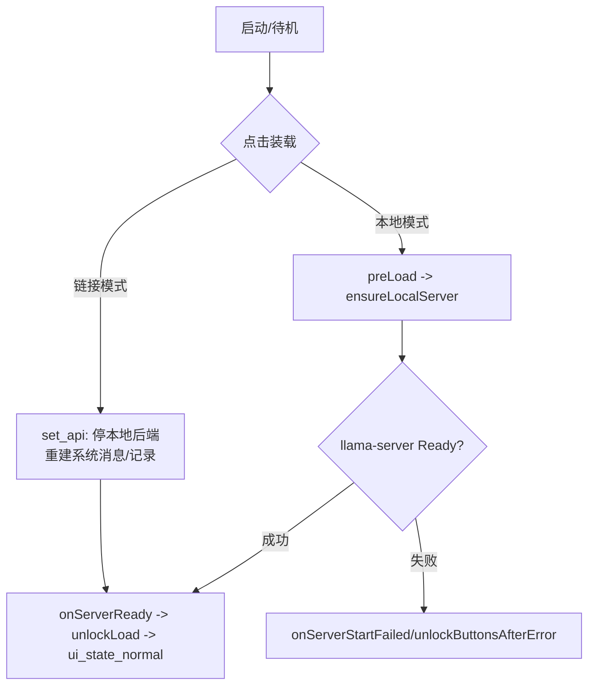
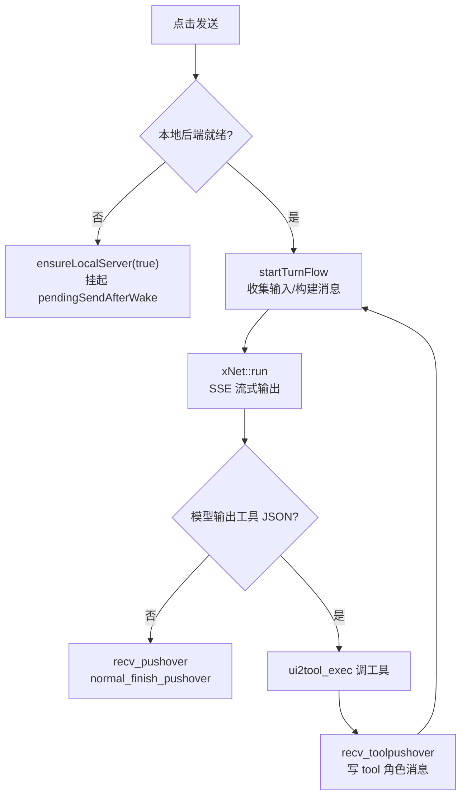
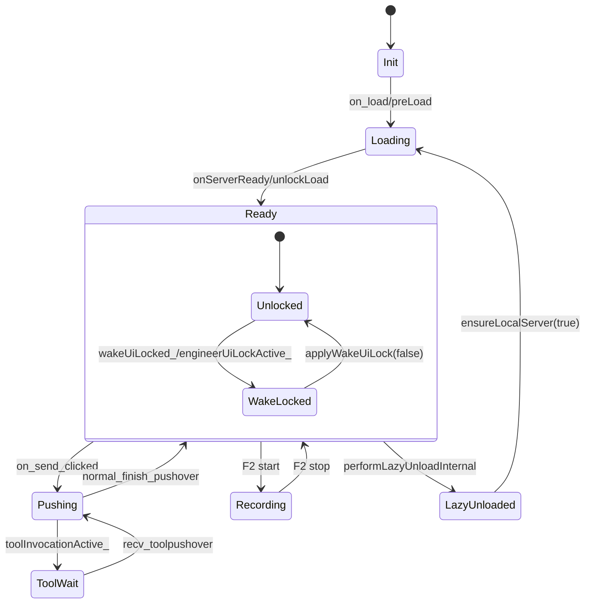

# 机体节点与状态梳理

## 1. 概述
- 目标：汇总机体从装载、发送、工具循环到重置的所有关键节点与状态标记，方便快速定位卡点与调试。
- 覆盖范围：`src/widget`（主界面/会话流转）、`src/xbackend.*`（本地后端）、`src/xnet.*`（网络请求）、工具流与惰性卸载控制。

## 2. 核心模式与状态
### 机体/对话模式
| 标识 | 定义位置 | 含义/触发 |
| --- | --- | --- |
| `LOCAL_MODE` / `LINK_MODE` | `xconfig.h::EVA_MODE` | 本地模式：启动/保持 llama-server，通过 `ensureLocalServer()` 维持；链接模式：停本地后端，使用远端 endpoint/key/model。 |
| `CHAT_STATE` / `COMPLETE_STATE` | `xconfig.h::EVA_STATE` | 对话/补完两种发送状态，约定/设置窗口切换。 |
| `ui_state` | `widget_state.cpp` | 当前界面状态（待机/装载中/推理中/录音中）。 |

### 界面状态（`widget_state.cpp`）
| 状态函数 | 触发 | 按钮/界面效果 |
| --- | --- | --- |
| `ui_state_init()` | 启动/配置加载前 | 仅“装载”可用，输入区置只读。 |
| `ui_state_loading()` | `preLoad()`、重启后端 | 全部按钮锁定，焦点在输入框，播放装载动画。 |
| `ui_state_pushing()` | 发送后 | 仅“重置”可用，输入可写，等待流式输出。 |
| `ui_state_normal()` | 装载完成/推理结束 | 根据 `ui_mode` 与 `is_load` 决定“发送/约定/设置”是否可用；补完模式下输入只读、输出可编辑。 |
| `ui_state_recoding()` | F2 录音 | 按钮全锁，输入显示录音状态占位。 |

### 运行标记（`widget.h` 关键字段）
| 标记 | 作用 |
| --- | --- |
| `is_load` | 当前模型/端点是否已就绪（本地需等 `onServerReady`）。 |
| `is_run` | 是否有在途推理/工具循环。 |
| `toolInvocationActive_` / `tool_result` | 是否正在等待工具返回/缓存的工具观测。 |
| `backendOnline_` / `lazyUnloaded_` / `lazyWakeInFlight_` | 本地后端存活、已惰性卸载、正在唤醒的三态。 |
| `pendingSendAfterWake_` | 发送被唤醒动作阻塞时的待办标记。 |
| `turnActive_` / `activeTurnId_` | 当前回合是否在途及其追踪 ID。 |
| `engineerProxyOuterActive_` | 系统架构师代理是否接管工具链。 |

### 流程阶段枚举
- 任务：`ConversationTask` = `ChatReply` / `Completion` / `ToolLoop`。
- 回合阶段：`FlowPhase` = `Start` → `Build` → `NetRequest` → `Streaming` → `NetDone` → `ToolParsed` → `ToolStart` → `ToolResult` → `ContinueTurn` → `Finish` / `Cancel`，通过 `FlowTracer` 统一打点。

### 网络层状态（`xnet.cpp`）
- `running_`：是否已有在途请求；`abortActiveReply()` 会中断 SSE 并触发 `net2ui_pushover`。
- `is_stop`：UI 触发的停止标记。
- `firstByteSeen_` / `promptTokens_` / `predictedTokens_`：流式首字节、提示/生成 token 统计。
- `thinkFlag` / `extThinkActive_`：是否处于 `<think>` 块或外部 reasoning 流。
- `sawToolStopword_`：已捕获 `</tool_call>`，继续等待 usage/timings。

### 后端生命周期节点（`widget_backend.cpp` / `xbackend.*`）
- `preLoad()`：清空界面与记录、进入 `ui_state_loading()` 并启动装载计时。
- `ensureLocalServer()`：根据端口/设备/模型参数启动或重启 `LocalServerManager`，处理端口降级与 Win7 CPU 回退。
- `onServerReady()`：标记 `backendOnline_=true`，绑定前端代理端口，注入系统消息，`unlockLoad()` 收尾并切回待机。
- `onServerStartFailed()` / `serverStopped`：解锁界面、必要时触发端口降级或设备 fallback。
- 惰性卸载：`scheduleLazyUnload()` → 倒计时 → `performLazyUnloadInternal()`（保持代理端口，释放 llama-server）；`lazyWakeInFlight_` 表示唤醒中。

## 3. 核心流程节点
### 装载与模式切换
1) 本地装载：`on_load_clicked` 选择本地 → `ui_SETTINGS.modelpath` 更新 → `preLoad()` → `ensureLocalServer()` → `onServerReady()` → `unlockLoad()` → `ui_state_normal()`。手动装载默认 `ngl=999`，装载完成后按 `max_ngl` 自动校准。
2) 链接模式：`on_load_clicked` 选择链接 → `set_api()` 清理本地状态、停止 llama-server、重建系统消息/记录，UI 切换暗色图标。

### 发送/推理主链
1) `on_send_clicked()`：若本地后端未醒则 `ensureLocalServer(true)` 并挂起；清空流式缓存，启动 `startTurnFlow()`。
2) 对话模式：`collectUserInputs()` 构造文本/图像/文档/音频，多模态消息写入 `ui_messagesArray`/历史，`handleChatReply()` 发送 `ui2net_data`+`ui2net_push`。
3) 补完模式：`handleCompletion()` 用输出区全文作为 prompt。
4) 网络层：`xNet::run()` 构造 OpenAI 兼容请求，流式 `net2ui_output`、`net2ui_kv_tokens` 等回传。
5) 结束：`recv_pushover()` 写入助手消息，如无工具则 `normal_finish_pushover()` 复位 UI 与 KV；`scheduleLazyUnload()` 延迟释放本地后端。

### 工具循环
- 在 `recv_pushover()` 检测 `<tool>...</tool>` JSON，触发 `ui2tool_exec()`，标记 `toolInvocationActive_`。
- 工具回传：`recv_toolpushover()` 写入 `tool_result` 并再次调用 `on_send_clicked()` 形成闭环；`handleToolLoop()` 以 `tool` 角色回灌消息并继续推理。

### 重置流程
- `on_reset_clicked()`：若工具在途则取消；若模型在跑则发送 `ui2net_stop(1)` 等待二次回调。
- 完整重置：刷新约定（重建系统 prompt）、清空记录/KV/监视帧，清除工具残留、停止解码，重置窗口标题与图标并完成 `finishTurnFlow("model reply finished")`。

### 惰性卸载与唤醒
- 活跃事件（推理/工具/后端日志）会 `cancelLazyUnload()`；空闲后 `scheduleLazyUnload()` 启动计时。
- 超时后 `performLazyUnloadInternal()` 停止 llama-server，保留代理端口；下次发送触发 `ensureLocalServer(true)`，`pendingSendAfterWake_` 确保唤醒后自动续发。

### 录音与监控输入
- F2 录音：`ui_state_recoding()` 锁定按钮并更新占位；录音结束后 WAV 作为 `input_audio` 追加用户消息。
- 监视帧：本地对话模式下按监视帧率自动附带最近 60 秒截图并在发送时一并提交。

## 4. 按钮可用性速查
| 界面状态 | 装载 | 约定 | 设置 | 发送 | 重置 | 备注 |
| --- | --- | --- | --- | --- | --- | --- |
| `init` | 可用 | 禁用 | 禁用 | 禁用 | 禁用 | 启动初始 |
| `loading` | 禁用 | 禁用 | 禁用 | 禁用 | 禁用 | 装载动画 |
| `pushing` | 禁用 | 禁用 | 禁用 | 禁用 | 可用 | 推理/工具在途 |
| `normal + chat` | 可用 | 载入/链接后可用 | 同左 | 载入/链接后可用 | 载入/链接后可用 | 默认待机 |
| `normal + complete` | 可用 | 可用 | 可用 | 载入/链接后可用 | 载入/链接后可用 | 输入只读，输出可编辑 |
| `recording` | 禁用 | 禁用 | 禁用 | 禁用 | 禁用 | 录音中 |

## 5. 流程图
### 装载与模式切换

### 一次发送/工具闭环

## 6. 参考代码定位
- 主界面状态与流程：`src/widget/widget_state.cpp`, `src/widget/widget_session.cpp`, `src/widget/widget_toolflow.cpp`, `src/widget/widget_backend.cpp`, `src/widget/widget_link.cpp`.
- 后端管理：`src/xbackend.*`, `src/widget/widget_backend.cpp`.
- 网络流式请求：`src/xnet.*`, `src/widget/widget_output.cpp`（输出渲染）。
- 监视帧/录音：`src/widget/widget_media.cpp`, `src/widget/widget_state.cpp`.

## 11. 工具调用核心链路
1) **约定注入**：在约定窗口勾选工具（计算器/文生图/知识库/MCP/系统工程师等）后，`get_date()` 将工具调用说明与系统提示词合并到 `ui_DATES.date_prompt`，并持久化当前工具开关。
2) **构建消息**：`on_send_clicked()` → `collectUserInputs()` 收集文本/图像/文档/音频，`handleChatReply()` 将用户消息入 `ui_messagesArray`，随后 `prepareEndpointData()` 带上系统指令与 stopwords 推送给 `xNet::run()`（OpenAI 兼容格式）。
3) **模型发起工具**：`recv_pushover()` 获取助手输出，利用 `XMLparser` 解析 `<tool>...</tool>` JSON（包含 `name/arguments`）。未命中工具即视为直接回答。
4) **工具执行**：命中工具则 `toolInvocationActive_=true`，`emit ui2tool_exec(tools_call)` 交由 `xtool` 路由（计算器、stablediffusion、知识库、MCP、系统工程师代理等），`FlowPhase::ToolStart` 打点。
5) **结果回灌**：工具结果通过 `recv_toolpushover()` 写入 `tool_result` 并以 `tool` 角色添加到 `ui_messagesArray`；`handleToolLoop()` 再次触发 `on_send_clicked()` 形成模型-工具闭环。
6) **结束判定**：当模型输出 `answer/response/system_engineer_proxy` 或无工具 JSON 时，`normal_finish_pushover()` 结束回合；补完模式会自动重置。
7) **提示词关注点**：工具启用会让系统提示词包含工具描述与调用格式（含 `<tool>` 包裹的 JSON）；工具链中 reasoning token 在 LINK 模式下会被扣除，避免 KV 记忆膨胀。

## 12. 系统架构师/工程师 Docker 沙盒流程
- **模式选择**：约定窗口的“docker target”下拉决定沙盒模式：`None`（不启用）、`Image`（基于镜像新容器）、`Container`（复用已有容器）。选择后写入 `dockerTargetMode_` 并持久化。
- **启用条件**：勾选系统工程师且目标模式 ≠ `None` 时，`ui_dockerSandboxEnabled=true`，主界面进入工程师锁（`engineerUiLockActive_` / `wakeUiLocked_`）直至沙盒就绪。
- **工作目录与挂载**：默认宿主工作目录 `{applicationDir}/EVA_WORK`；容器内统一 `/eva_workspace`，技能目录 `/eva_skills` 自动映射。缺失挂载时会提示修复并调用 `ui2tool_fixDockerContainerMount`。
- **就绪判定**：`recv_docker_status` 返回 `ready=true` 后解锁；容器模式若缺少绑定会弹窗提示并在确认后重建容器。状态会刷新系统提示块，提示当前镜像/容器、挂载路径。
- **操作路径**：
  1) 打开约定/设置 → 选择 docker 模式与镜像/容器 → 确认后写入配置。
  2) 若需要，切换工程师工作目录（影响挂载源），再刷新约定以更新系统提示词。
  3) 触发发送时，如沙盒未就绪会延迟并保持 UI 锁，待就绪后自动继续。
- **异常处理**：沙盒错误会保持锁定并输出错误信息；用户可重开约定/设置调整镜像/容器或关闭沙盒（选择 None）后解锁。

## 7. 异常恢复速查
| 场景 | 触发节点 | UI/状态处理 | 操作建议 |
| --- | --- | --- | --- |
| 本地后端启动失败 | `onServerStartFailed` | 解锁按钮、停止动画，必要时端口降级或 Win7 CPU 回退 | 检查端口占用/后端可执行文件，重新装载或改端口 |
| 端口冲突 | `onServerOutput` 检测 bind 失败 | 触发 `initiatePortFallback`，降级到随机/可用端口 | 记录提示后自动重试，必要时手动指定新端口 |
| 推理中止（手动停） | `on_reset_clicked` -> `ui2net_stop(1)` | 停止 SSE，`recv_stopover` 后自动重置 | 如需保留上下文，可改用补完模式手动编辑 |
| 工具异常/取消 | `toolInvocationActive_` + `ui2tool_cancelActive` | 立即解锁，输出“tool cancelled” | 重新触发发送或检查工具参数 |
| 后端异常日志 | `onServerOutput` 检测 fatal/segfault | 停动画，`unlockButtonsAfterError`，`is_run=false` | 查看终端日志，重启后端/更换模型 |
| 惰性卸载超时 | `performLazyUnloadInternal` | 仅停 llama-server，保留代理端口 | 发送时自动唤醒；如频繁唤醒可关闭惰性卸载或延长超时 |

## 8. 锁与状态转移细化

## 9. KV/Token 更新路径
- **提示基线**：`net2ui_prompt_baseline` / `recv_turn_counters` / llama-server `prompt done` 日志 → `kvPromptTokensTurn_`、`kvUsedBeforeTurn_` 更新。
- **流式生成**：`net2ui_kv_tokens` / `recv_turn_counters` / `total time` 日志 → `kvStreamedTurn_`、`kvTokensTurn_`、`kvUsed_` 更新。
- **LINK 特例**：缺少本地日志时接受网络侧增量；工具链时剔除 reasoning token 避免记忆膨胀。
- **UI 展示**：`updateKvBarUi()` 统一转换百分比；`FlowTracer` 的 `FlowPhase::NetRequest/Streaming/NetDone` 帮助追踪回合耗用。

## 10. 增殖窗口与技能入口
- 窗口索引（`xconfig.h::window_map`）：软件介绍、模型信息、模型评估、模型量化、MCP、知识库、文生图、声转文、文转声。
- 触发：主界面按钮/托盘菜单调用 `ui2expend_show(PREV_WINDOW/指定窗口)`。
- 依赖摘要：
  - 知识库：需要嵌入服务端口 `DEFAULT_EMBEDDING_PORT`，上传文本后向量入库；启用“知识库”工具时可检索。
  - 文生图：默认模型路径 `EVA_MODELS/text2image/sd1.5-anything-3-q8_0.gguf`，工具名 `stablediffusion`，图像结果通过 `<ylsdamxssjxxdd:showdraw>` 回填。
  - 声转文/文转声：默认路径分别绑定最小 whisper/tts.cpp 模型。
  - 模型量化/评估：依赖 `EVA_BACKEND` 下对应可执行文件，按当前模式显示。
- 技能：`SkillManager` 异步加载技能，右键系统工程师可升级为系统架构师代理，工具调用由 `system_engineer_proxy` 统一出入口。
