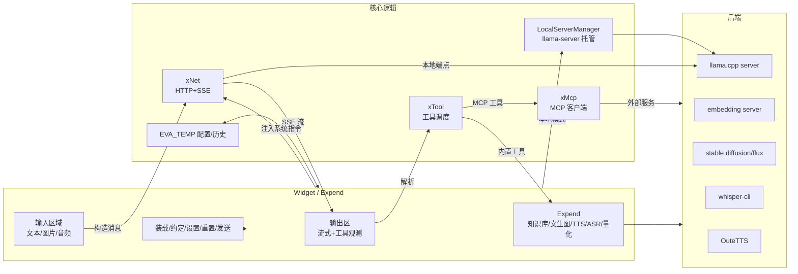
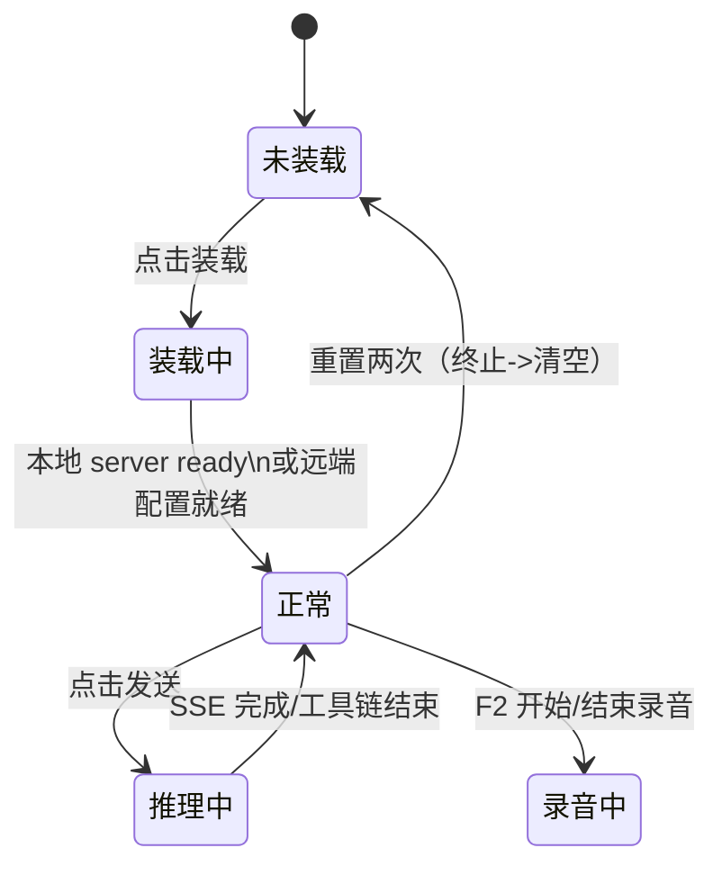
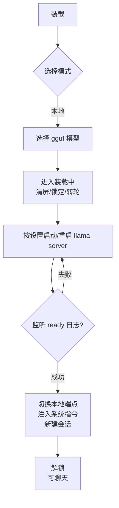
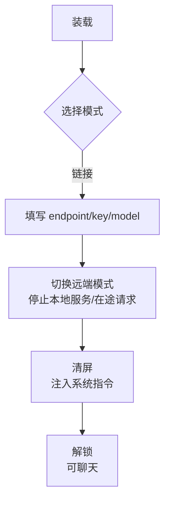
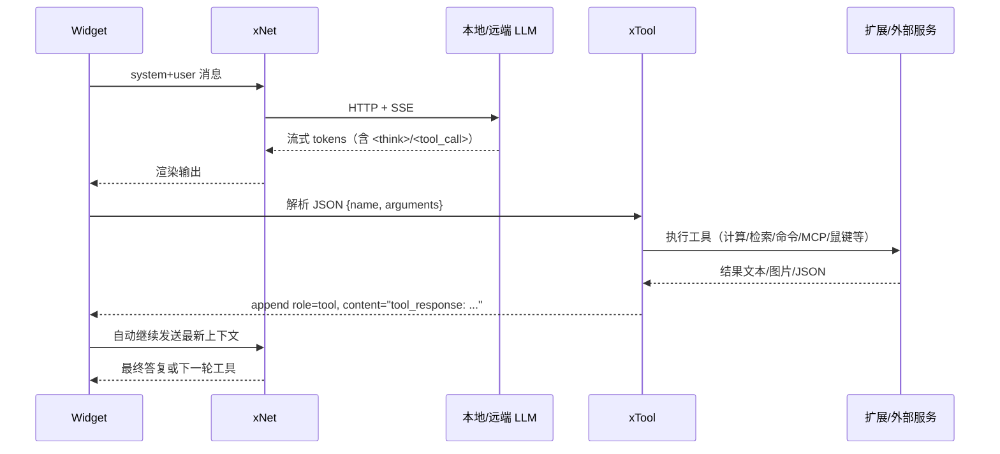
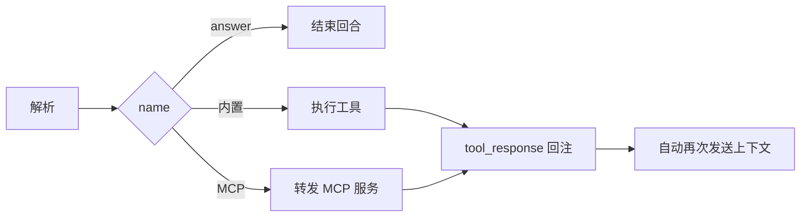
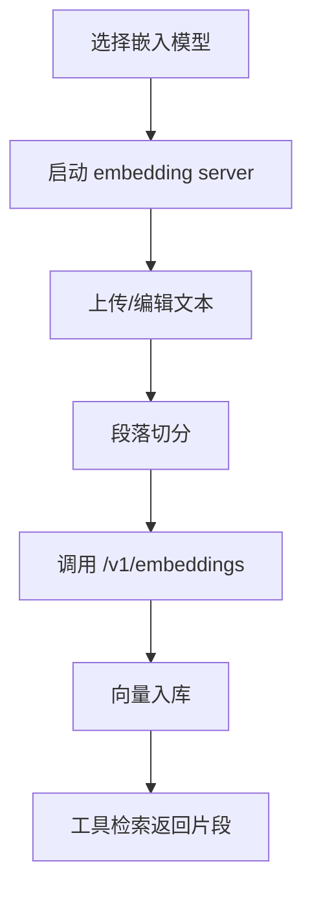

# 机体 EVA 软件技术说明书

本说明书面向 EVA 机体的研发、测试、运维与产品团队，提供一份结构化、可执行的系统指南。文档按照“从整体到细部、从职责到流程、从运行到运维”的逻辑展开，确保在遵循中央教条的同时具备良好可维护性。

## 1. 范围与读者

- **研发与架构**：理解整体设计、组件接口、扩展点，指导开发与重构。
- **测试与运维**：掌握运行模式、状态切换与日志来源，支持部署、回归与排障。
- **产品与文档**：明确能力边界、交互流程与术语，确保对外一致性。

## 2. 技术基线

- **语言 / 框架**：C++17 + Qt 5.15。
- **平台**：Windows、Linux（含 AppImage）。GPU 后端支持 CUDA / Vulkan / OpenCL / CPU。
- **本地推理内核**：llama.cpp（server 模式）。
- **远端协议**：OpenAI 兼容 API（`/v1/chat/completions`、`/v1/completions`）。
- **第三方组件**：whisper.cpp（ASR）、Stable Diffusion/Flux（文生图）、tts.cpp（TTS）。
- **编码规范**：UTF-8（无 BOM），默认换行 LF。

## 3. 术语表

| 术语 | 含义 |
| --- | --- |
| 机体 / EVA | 本项目的桌面应用（大前端）。 |
| 约定框架 / data framework | 通过系统提示与输出解析限制模型行为的行动接口。 |
| 素体 | 第三方后端程序（如 llama.cpp）。 |
| 驾驶员 | 大语言模型（本地 gguf / 远端模型名）。 |
| 指挥员 | 用户。 |
| 四大类 | `net`（网络）、`widget`（窗口/UI）、`tool`（工具）、`expend`（增殖）。 |
| 拘束器 | 解析模型输出、抽取工具请求的逻辑。 |

## 4. 架构概览

### 4.1 组件职责

- **widget**：主窗口，负责 UI 状态机、快捷键、历史持久化、工程师终端、按钮逻辑。
- **expend**：增殖窗口，承载知识库、模型信息、评估、量化、文生图、语音能力，托管外部进程。
- **xNet**：统一 OpenAI 兼容请求，管理 HTTP + SSE，统计首包、生成速度、timings。
- **xTool**：解析模型 `<tool_call>`，调度内置工具、工程师工具、MCP 工具；推送终端输出。
- **xMcp**：MCP 客户端，实现 SSE/stdio 通道管理，与 xTool 交互。
- **LocalServerManager**：本地 llama.cpp server 托管，负责启动、重启、日志转发、状态感知。

### 4.2 中央教条

- 所有推理均通过 HTTP 完成，本地模式也视作访问本地 server。
- 四大类应当职责清晰，可独立演进但保持协同。
- 约定框架由开发者提供拘束器、工具与约定指令，模型通过 `<tool_call>{json}</tool_call>` 驱动受控行为，用户决定启用的工具。
- 工程师上下文：UI 在装载后注入 `ENGINEER_INFO`，包含 OS、日期、默认 Shell/Python、工程师工作目录、`EVA_WORK` 两层目录快照，约束模型仅在指定根目录行动。

## 5. 运行模式与状态

### 5.1 模式与状态

- **对话模式**：多轮聊天，支持文本、图片、音频及工具链。
- **补完模式**：将输出区作为 prompt，一次性补全。
- **本地模式**：托管 llama.cpp server，自动切换本地端点。
- **链接模式**：使用远端 endpoint/key/model，停用本地服务。

### 5.2 UI 状态机

按钮与可用性：
- **装载**：装载前唯一可用；装载中全禁；正常时全可用；推理中仅重置可用。
- **约定**：编辑系统提示词、昵称、工具开关，确认后重置上下文。
- **设置**：采样参数即时生效；涉及模型/设备/nctx/ngl/lora/mmproj/并发/批/端口时，会重启本地 server。
- **重置**：首次终止当前回合，再次清空对话并新建会话。
- **发送**：组装消息发送给 xNet，接收 SSE 并驱动工具循环。

### 5.3 UI 辅助元素

- **快捷键**：F1 截图、F2 录音、Ctrl+Enter 发送、TerminalPane 内 Ctrl+C 中断命令。
- **记录条 / RecordBar**：输出区与输入区之间的色块时间线（system/user/assistant/think/tool），悬停提示、单击定位、双击编辑并同步历史。
- **TerminalPane**：状态区右侧的终端面板，显示工程师工具与 MCP 命令的 stdout/stderr，工具执行时自动展开，可 Stop 或 Ctrl+C 中断，支持手动输入命令（使用当前工程师工作目录）。
- **KV 进度条**：顶部双进度条实时展示 prompt 与生成占用，链接模式缺口时以 `usage.prompt_tokens` 兜底。
- **系统托盘**：提供“显示主窗”“显示增殖”“触发截图”“退出”等入口，隐藏窗口时仍可唤回。
- **工程师工作目录**：默认 `EVA_WORK`（应用同级），可在约定面板修改；修改后刷新 TerminalPane、工具及提示词上下文。

## 6. 核心工作流

### 6.1 本地装载流程

启动细节：
- 根据设备选择自动估算 GPU offload（ngl），装载后以 `n_layer+1` 校准。
- 若配置缺省，自动从 `EVA_MODELS` 选择最小的 gguf 模型、embedding、whisper、tts.cpp、sd1.5-anything-3。
- 本地 server stdout/stderr 传入增殖窗口“模型日志”。

### 6.2 链接模式装载

### 6.3 发送 / 推理流程

- `widget` 组装 OpenAI 兼容 `messages`（含 system + user，可包含 `text/image_url/input_audio`）。
- `xNet` 创建请求体，建立 HTTP 连接，解析 SSE 分块。
- `<think> .. </think>` 用于渲染推理思考区域；`xNet` 统计 reasoning tokens。
- `<tool_call>{json}</tool_call>` 触发工具调用，SSE 在关闭前保留以等待 usage/timings。

### 6.4 工具循环

### 6.5 多模态输入

- **图像**：拖拽、上传或 F1 截图，作为 `image_url` 附在 user 消息。可启用“监视帧率”自动附带最近屏幕帧。
- **音频**：上传 WAV/MP3/OGG/FLAC；发送前转换为 OpenAI `input_audio`。
- **F2 录音转写**：第一次选择 whisper 模型；再次 F2 录音，结束后自动调用 whisper-cli，结果回填输入框。

### 6.6 自动弹出（惰性卸载）

- **目标**：在本地模式长时间运行时按需释放 llama.cpp 占用的显存与算力，同时保持 UI 状态与会话上下文不丢失。
- **计时器与激活条件**：当 `lazy_unload_minutes` 大于 0 且模式为本地时，`Widget::scheduleLazyUnload()` 会在后端就绪、推理或工具链结束后启动单次计时器；`markBackendActivity()` 在用户输入、SSE 流、工具响应及代理流量到达时重置倒计时，确保活跃会话不会被卸载。
- **倒计时与交互**：设置面板显示“弹出倒计时”标签，由 `lazyCountdownTimer_` 每秒刷新剩余时间；右键该标签触发 `onLazyUnloadNowClicked()` 可立即弹出；将倒计时设为 0 即可禁用惰性卸载，配置持久化在 `EVA_TEMP/eva_config.ini` 的 `lazy_unload_minutes` 字段。
- **执行阶段**：计时到期时 `performLazyUnloadInternal(false)` 异步停止 `llama-server`，保留状态区日志（`lazyUnloadPreserveState_`）并输出 `auto eject stop backend`、`auto eject sleeping` 提示；本地代理 `LocalProxyServer` 继续占用前端端口，对新 HTTP 请求返回 503，同时记录访问来源。
- **唤醒流程**：指挥员再次发送消息或外部客户端访问端口时，代理触发 `wakeRequested`，UI 提示“正在唤醒本地后端”，通过 `ensureLocalServer(true)` 重启 llama.cpp；若发送发生在休眠期间，`pendingSendAfterWake_` 会在后端就绪后自动补发请求并重新开启倒计时。

### 6.7 本地代理实现

- **设计目标**：`LocalProxyServer` 充当 UI/第三方客户端与 llama-server 之间的缓冲层，保持前端端口常驻、屏蔽后端重启细节，并在惰性卸载时准确捕获外部访问信号触发唤醒。
- **监听与会话**：代理内部持有一个 `QTcpServer`，监听 UI 绑定的“前端端口”。每次 `newConnection` 都实例化 `ProxySession`，该会话维护到客户端和后端的 `QTcpSocket`，并以 `LowDelayOption` 降低转发时延。
- **后端通道管理**：`ProxySession::setBackendEndpoint()` 跟随 UI 更新后端地址；`start(backendReady)` 决定立即连后端或等待。后端未就绪时，会话记录请求数据，开启 30 秒等待定时器，并加入 `pendingSessions_` 等待唤醒。
- **唤醒机制**：代理维护 `backendReady_` 标记。若未就绪且收到新的客户端连接，将触发 `wakeRequested` 信号；Widget 槽函数调用 `ensureLocalServer(true)` 拉起 llama-server，同时用 `externalActivity` 通知 UI 更新惰性卸载倒计时。
- **数据转发与故障**：后端连通后，`flushPendingClientData()` 把缓存请求回放到 llama-server，并在后续直接转发双向数据。当后端断开、超时或连接失败时，会话构造 JSON 体的 503 响应并关闭连接，确保调用方得到明确反馈。
- **状态同步**：Widget 根据 `LocalServerManager` 的回调调用 `setBackendAvailable(true/false)`，驱动代理把挂起会话切换为正式连接或重新排队；`shutdownSessions()` 用于应用退出或端口重绑场景的快速清理。
- **端口保持**：即便后端惰性卸载，代理依旧占有前端端口，外部工具不会感知短暂的后端消失；恢复时仅需恢复 TCP 隧道即可，避免窗口提示“端口被占用”或客户端重连失败。

## 7. 工具体系与安全

### 7.1 内置工具

| 名称 | 作用 |
| --- | --- |
| `answer(content)` | 最终答复用户。 |
| `calculator(expression)` | 表达式计算（tinyexpr）。 |
| `execute_command(content)` | 在工程师工作目录执行命令，输出 stdout/stderr。 |
| `knowledge(query, top_n, filters?)` | 向量检索返回 Top-N 文本片段。 |
| `controller(sequence)` | 鼠标键盘编排，执行后返回截图。 |
| `list_files/search_content/read_file/write_file/replace_in_file/edit_in_file` | 文件读写与检索。 |
| `stablediffusion(args)` | 文生图，返回带标记的图片路径。 |

### 7.2 MCP 集成

| 维度 | 说明 |
| --- | --- |
| **配置入口** | 增殖「MCP 服务」面板，读取/写入 `EVA_TEMP/mcp_servers.json`，UI 支持上传 JSON、手动增删、批量启用。 |
| **传输协议** | - `streamableHttp`：HTTP POST + 可选 GET `text/event-stream`，自动保存 `Mcp-Session-Id`，当服务器拒绝 GET(405) 时退化为响应内推流。 - `sse`：两段式（GET 建立 SSE 流 + POST 消息端点），支持服务端 `endpoint` 事件动态改写消息地址。 - `stdio`：通过 `QProcess` 启动外部可执行文件（llama.cpp、Python server 等），使用换行 JSON 双向通信。 |
| **配置字段** | 通用字段：`name`、`description`、`isActive`、`headers`、`env`、`clientName`/`clientVersion`。 `streamableHttp|sse` 需要 `baseUrl`（必要时附带 `sseEndpoint`），`stdio` 需要 `command`+`args`。 为兼容外部导入，`type` 支持 `sse` / `streamableHttp` / `http` / `stdio`，旧版 `url` 自动映射到 `baseUrl`。 |
| **挂载流程** | 1. 用户在面板勾选服务；2. `Expend` 通过 `expend2mcp_addService` 下发；3. `McpToolManager::addServer` 解析配置、构造客户端并调用 `initialize`；4. 成功后缓存 `listTools` 结果并通过 `expend2ui_mcpToolsChanged` 反馈 UI。 |
| **工具路由** | xTool 收到模型 `<tool_call name="service@tool">` 后分离服务名与工具名，调用 `McpToolManager::callTool`，其内部会自动重试、捕获 JSON-RPC 错误，并把结果封装为 `tool_response: ...` 追加到对话。 |
| **通知/进度** | - SSE/Streamable HTTP：若服务器提供 GET SSE，则实时触发 `serverNotificationReceived`/`serverMessageReceived`，UI 状态区同步展示。 - Streamable HTTP 在服务端拒绝 GET 时，会退化为解析 POST 响应中的 `text/event-stream` 块，仍能获取本次调用的进度。 - stdio：依靠子进程 stdout 事件直接推送。 |
| **日志与容错** | 所有客户端都挂接到 `qmcp.xxx` 日志域，终端右侧终端面板会显示初始化、SSE 断线、工具调用失败等信息；初始化失败会提示“Failed to initialize <type> server”，并继续处理其他服务，避免单点阻塞。 |

> 小结：xTool 与 xMcp 之间完全以信号槽隔离，MCP 工具与本地工具在模型视角保持统一接口，便于驾驶员随时切换“外部约定”。

### 7.3 安全边界

- 工程师工作根：所有文件操作、命令执行与终端手动命令均受限于 `engineerWorkDir`（默认 `EVA_WORK`），修改后即时持久化并同步终端。
- 高风险工具（如 `controller`、`execute_command`）默认关闭，需要用户在约定面板显式启用。
- 输出、工具观测、历史记录均持久化，敏感信息需谨慎处理。
- TerminalPane 由 `tool2ui_terminal*` 信号驱动，记录命令开始、输出、结束；手动命令通过 `cmd /c`（Windows）或 `/bin/sh -lc`（Linux）执行，可使用 Stop 中断。

### 7.4 工具调用流程图

### 7.5 技能系统整合

技能（Skill）为 EVA 在约定框架下引入的可插拔能力包，规范与实现均对齐参考项目 `参考项目/skills-main` 中的 Agent Skills 体系。通过该机制，指挥员可在不改动主程序的情况下，为“驾驶员”注入特定场景的流程、模板与脚本指令。

- **规范约束**：`skills-main/agent_skills_spec.md` 定义了技能的语义与协作流程。每个技能都必须提供 `SKILL.md`，文件以 YAML frontmatter 描述 `name`、`description`、`license` 等元数据，正文给出操作步骤、输入输出格式、注意事项。EVA 在解析时严格依赖这些字段，缺失将直接拒绝导入。
- **包结构与导入**：技能以压缩包分发，根目录持有 `SKILL.md`、可选的 `assets/`、`scripts/`、`README.md` 等资源。拖拽 `.zip` 至 UI 的技能坠落区（`src/widget/skill_drop_area.*`）后，`SkillManager::importSkillArchiveAsync` 会调用 `zip::extractArchive` 临时解包，查找 `SKILL.md`，并将内容复制到应用目录下的 `EVA_SKILLS/<skill-id>`。若目标目录已存在，则先安全删除旧版本，再写入新版。
- **扫描与持久化**：`SkillManager::loadFromDisk` 启动时遍历 `EVA_SKILLS` 与内置的 `bundled_skills`（`src/skill/skill_manager.cpp`），解析 frontmatter 并生成 `SkillRecord` 列表，指挥员上次勾选的启用状态会通过 `restoreEnabledSet` 还原。右键可移除技能，操作将递归删除对应目录。
- **提示块注入**：当系统工程师工具链激活时，`SkillManager::composePromptBlock` 会插入“[Skill Usage Protocol]”提示块到系统指令，明确要求模型在调用技能前使用 `read_file` 拉取 `SKILL.md`、在 `execute_command` 中运行脚本，并始终将产物写回工程工作目录。这段提示会根据运行环境列出宿主或容器中的绝对路径（Docker 下展示 `/eva_workspace`、`/eva_skills`），便于驾驶员精确定位资源。
- **运行期协作**：模型若在对话中引用技能指令，将根据技能文档与挂载的工具（如 `execute_command`、`knowledge`）组合行动。技能脚本默认以工程工作目录（`engineerWorkDir`）为根，防止越权访问；所有执行回执通过工具响应写入对话，形成可追溯的“技能调用→工具反馈→继续推理”循环。

## 8. 增殖能力总览

### 8.1 知识库

- 构建：选择嵌入模型 → 启动 embedding server（`/v1/embeddings`） → 上传/编辑文本 → 切分段落 → 获取向量 → 入库。
- 检索：xTool 计算查询向量，与本地向量库求余弦相似度，返回 Top-N。
- 自动托管：若已有持久化向量库或勾选嵌入服务需求，启动阶段自动拉起 llama.cpp embedding server，关闭应用时安全终止。

### 8.2 文生图

- 调用 stable diffusion / flux 可执行或脚本。
- 结果通过特殊标记回注，UI 在输出区呈现图片。

### 8.3 声转文 / 文转声

- **Whisper**：F2 录音 → whisper-cli → 文本回填。
- **TTS**：tts.cpp，增殖窗口按段播放流式输出。

### 8.4 模型信息与量化

- 模型信息：3D 神经元背景日志控件（NeuronLogEdit），懒加载动画节省资源。
- 模型评估：详见第 11 章“观测与评估”。
- 量化与转换：f32/f16/bf16/q8_0 等量化；支持 HF → GGUF 转换脚本。

## 9. 运行时管理

### 9.1 后端目录约束

- 目录结构：`EVA_BACKEND/<arch>/<os>/<device>/<project>/<executable>`。
- `DeviceManager` 负责扫描可用 backend（cpu/cuda/vulkan/opencl），支持 `auto` 选择与回退。
- 支持架构：x86_64 / x86_32 / arm64 / arm32；操作系统：win / win7 / linux / mac。
- `programPath()` 根据设备排序查找可执行，透传日志帮助诊断。

### 9.2 GPU offload 策略

- 基于显存、模型体积、上下文长度估算 `ngl`，力求在不溢出的前提下拉满。
- 装载后根据日志中的 `n_layer` 修正展示（n_layer+1）。
- 如果选择 LoRA，会强制 `--no-mmap` 以保持跨平台稳定。

### 9.3 自动目录

- `EVA_TEMP`：配置、历史、临时产物。
- `EVA_WORK`：默认工程师工作区；首次启动创建，可在约定面板修改。
- TTS 临时目录：位于 `EVA_TEMP/tts`，避免污染工作区。

## 10. 配置与持久化

- **EVA_TEMP/eva_config.ini**：通过 `QSettings` 存储模型路径、设备、采样参数、端点、工具开关、工程师工作目录等。首启缺省时自动写入默认模型。
- **工程师系统指令**：`ENGINEER_SYSTEM_INFO` 注入操作系统、日期、Shell、Python、工作目录、`EVA_WORK` 目录快照，提醒模型仅在该目录内执行命令。
- **历史会话**：`EVA_TEMP/history/<id>/{meta.json,messages.jsonl}`，支持右键菜单或增殖窗口打开“历史会话管理”对话框，提供搜索、重命名、删除、清空、双击恢复，操作即时持久化。
- **RecordBar 同步**：历史恢复时重建记录条；双击编辑后写回 `messages.jsonl`。

## 11. 观测与评估

### 11.1 SSE 观测

- `xNet` 跟踪总用时（`t_all_`）、首包用时（`t_first_`）、超时保护（QTimer）。
- 收集 llama.cpp `timings.prompt_ms/prompt_n` 与 `timings.predicted_ms/predicted_n`，计算 prompt/gen tokens/s。
- reasoning 流：支持 `<think>` 标签与第三方 `reasoning` 字段，UI 分流渲染。
- KV 统计：本地模式取 server 日志，链接模式根据 `usage.prompt_tokens` 与流式增量估算。

### 11.2 模型评估模块

- 入口：增殖窗口“模型评估”页；包含 Start/Stop 控件、表格与迷你柱状图（TTFB、生成、常识、逻辑、工具、同步率）。
- 运行：独立线程中的 `xNet` 负责请求；评估逻辑位于 `src/expend/expend_eval.cpp`。
- 测项：
  1. **首包响应（TTFB）**：发送 1024 个 'A'，收到首字符立即终止；500 ms 以上线性降分。
  2. **生成速度**：默认 2 轮长文本；优先使用服务器返回的 `gen_per_s`，否则以片段数量/时间估算。
  3. **常识问答**：`qa1..qa5` 单选题，解析答案字母与标准答案比对。
  4. **逻辑题**：`logic1..logic5` 单选题。
  5. **工具调用**：注入 6 项内置工具描述，要求仅输出一个 `<tool_call>`。
- **同步率**：`Sync = clamp(0,100,0.10*TTFB + 0.20*Gen + 0.20*QA + 0.20*Logic + 0.30*Tools)`。
- **容错**：网络错误触发 `WRONG_SIGNAL`，记录状态并终止流程；用户可随时 Stop。
- UI 资源：`src/expend/expend.ui`、`src/utils/minibarchart.*`。

### 11.3 TerminalPane 监控

- 保留 4000 行以内的命令输出，超限自动截断。
- 支持 Stop 按钮和 Ctrl+C；命令提示符包含工作目录。
- 供 `execute_command` 与 MCP 工具共享，也支持用户手动输入命令。

## 11. Docker 沙盒机制

EVA 在系统工程师工具下提供可选的 Docker 沙盒，保证模型的 `execute_command`/`read_file` 等操作在隔离环境中执行，同时仍能访问宿主工程目录。

### 11.1 启用流程

- 用户在“约定”面板勾选“系统工程师”后，可在同一行的下拉框中选择 Docker 沙盒模式：`None` 表示不启用（默认），`镜像` 表示使用本地镜像启动沙盒，`容器` 表示复用已有容器。选择镜像/容器时可继续填写镜像名或容器名，列表会根据 `docker images` / `docker ps -a` 自动补全。
- `Widget::syncDockerSandboxConfig` 汇总工作目录、镜像、启用标记，通过 `ui2tool_dockerConfigChanged` 下发给 xTool。
- 约定窗口提供“镜像模式 / 容器模式”切换。容器模式会列出 `docker ps -a` 中的容器，用户选择后 EVA 会自动在 `/eva_workspace` 重新挂载当前工程目录，并把 EVA 技能根目录映射到 `/eva_skills`；若容器已运行，会提示并先执行 restart。检测到所选容器缺少 `/eva_workspace` 或 `/eva_skills` bind mount 时，UI 会弹出确认对话框，确认后 EVA 会停止并重建该容器，使其挂载当前工程目录与技能目录后再恢复沙盒。
- xTool 使用 `DockerSandbox`（`src/utils/docker_sandbox.*`）管理容器：  
  1. `applyConfig` 根据“工作目录 + 镜像”生成稳定的容器名（`eva-sandbox-<hash>`）；  
  2. 检查 docker 是否可用 → 镜像是否存在（必要时 `docker pull`）→ 容器是否存在；  
  3. 不存在时自动 `docker run -d --name <hash> -w /eva_workspace -v <宿主工作目录>:/eva_workspace -v <技能目录>:/eva_skills <image>`；存在但未运行则 `docker start`；
  4. 读取容器环境（`uname -sr`、`/etc/os-release`）并通过信号反馈给 UI。
- EVA 会把容器状态附加到工程师提示词中，例如“Docker container (ubuntu:latest)”以及挂载点 `/eva_workspace`、`/eva_skills`。

### 11.2 路径映射与工具执行

- 工程师工作目录默认为 `EVA_WORK`（可自定义），在沙盒模式下以 `/eva_workspace` 挂载；技能管理器的 `EVA_SKILLS` 目录会同步挂载到 `/eva_skills`，方便在容器内直接调用技能脚本。  
- 在 Docker 沙盒内，`read_file` / `write_file` / `replace_in_file` / `edit_in_file` 等工具可以直接填写容器绝对路径（以 `/` 开头），此时 EVA 会跳过宿主工作区校验，直接在容器内执行 `cat`/`tee` 等操作。仍然需要指挥员注意安全，避免向模型暴露不必要的宿主挂载。  
- 所有工程师工具调用都会先通过 `resolveHostPathWithinWorkdir` 校验路径是否位于工作根内，然后映射为容器路径。  
- `execute_command` 通过 `docker exec -i <container> /bin/sh -lc "<cmd>"` 运行；`read_file`/`write_file`/`replace_in_file`/`list_files` 等函数改为读取容器内文件（必要时执行 `mkdir -p`，写入用 `cat > file`）。  
- TerminalPane、Docker 状态栏实时显示容器名、镜像、挂载目录、OS 信息，避免模型误判执行环境。

### 11.3 持久化与生命周期

- 镜像、容器名与启用状态持久化在 `EVA_TEMP/eva_config.ini` 中（键：`docker_sandbox_mode`、`docker_sandbox_checkbox`、`docker_sandbox_image`、`docker_sandbox_container`）。`docker_sandbox_mode` 支持 `none/image/container` 三种取值，旧版遗留的 `docker_sandbox_checkbox` 会兼容读取为镜像模式。  
- 启动时若工程师工具启用，UI 会从配置直接读取镜像并回填下拉框，随后刷新镜像列表；未检测完成前也会沿用该值。  
- 关闭应用时，`main.cpp` 会通过 `shutdownDockerSandbox()` 禁用沙盒并调用 `docker stop`，确保不会留下僵尸容器；下次启动仍会复用同一容器名，保留依赖缓存。  
- 若 Docker 命令不可用或权限不足，状态会显示失败原因，工程师提示词也会标记“Sandbox pending”。

### 11.4 兼容性与注意事项

- 需要宿主系统已安装 Docker 且当前用户具备无密码的 `docker` 访问权限（Windows 使用 Docker Desktop，Linux 推荐加入 docker 组或 rootless Docker）。  
- 沙盒镜像应包含所需构建工具（git/cmake/g++/clang/node/python 等），EVA 不负责镜像定制。  
- 由于所有命令都在 `/eva_workspace` 内执行，而技能脚本可通过 `/eva_skills` 读取，请确保工程师工作目录与技能目录仅包含允许模型访问的内容。若需隔离多个项目，可为每个项目配置独立的工作目录。

## 12. 部署与发布

- **打包内容**：
  - 主程序 `build/bin/eva(.exe)`。
  - `EVA_BACKEND`：llama.cpp / whisper / TTS / SD 可执行与依赖。
  - 可选 `EVA_MODELS`：llm / embedding / speech2text / text2speech / text2image。
  - 资源（图标、动画、字体）与许可证。
- **启动守护**：
  - `SingleInstance` 保证按应用路径单实例，二次启动仅唤醒已有窗口。
  - 启用 Qt 高 DPI 缩放与 `simsun.ttc` 字体，确保中英文字体一致。
  - AppImage 自动设置 `APPDIR`、`APPIMAGE`、`LD_LIBRARY_PATH`，支持 `EVA_BACKEND_ROOT` 环境变量。
  - 启动时自动创建 `EVA_TEMP`、`EVA_WORK`、TTS 缓存目录，并为缺省配置写入 `eva_config.ini`。

## 13. 测试与验证

- **单元测试**：覆盖工具参数校验、SSE 解析、工程师工具流。
- **功能测试**：本地/链接装载切换、工具循环、知识库嵌入与检索、ASR/TTS、文生图。
- **端到端**：快捷键、截图、录音、发送、工具调用链，含硬件/网络异常场景。
- **兼容性**：Windows/Linux、CPU/GPU、不同显存、端口冲突、多语言界面。

## 14. 关键文件索引

- 本地后端管理：`src/xbackend.*`
- 网络层与 SSE：`src/xnet.*`
- 主窗口与流程：`src/widget/*`
- 约定与工具：`src/prompt.*`、`src/xtool.*`
- MCP 客户端：`src/xmcp.*`、`src/mcp_tools.h`
- 增殖窗口：`src/expend/*`
- 历史与配置：`src/utils/history_store.*`、`EVA_TEMP/*`
- 终端面板：`src/widget/terminal_pane.*`
- 设备探测：`src/utils/devicemanager.*`
