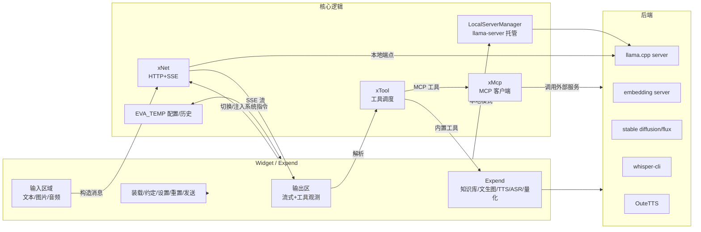
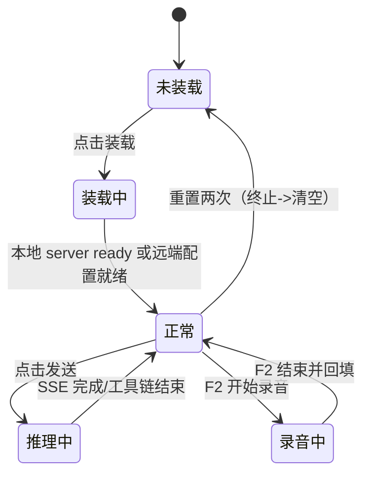
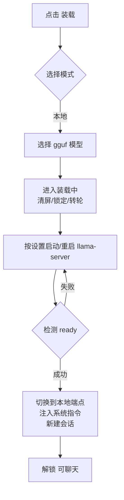
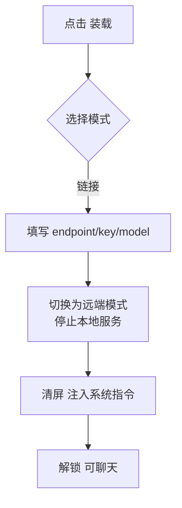
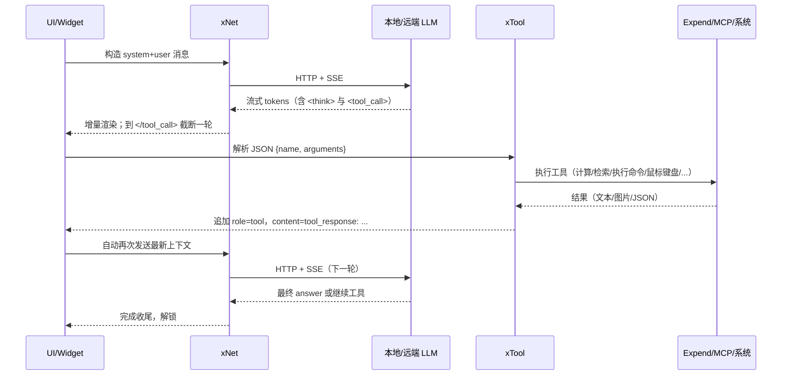
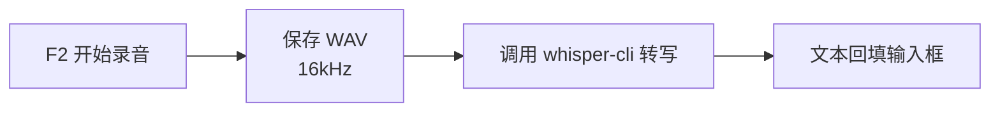
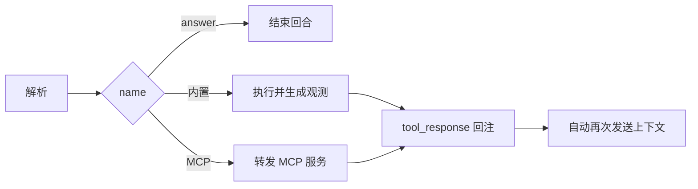
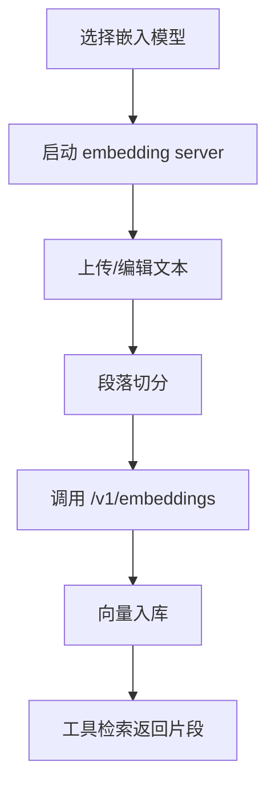

# 机体 EVA 软件技术说明书

本文为 EVA（机体）项目的软件技术说明书重构版，聚焦“清晰的架构视图、可执行的规范、可落地的流程”。在不改变现有实现意图与中央教条的前提下，对文档结构与内容进行系统化整理，以便研发、测试、运维与产品协同。

适用读者
- 研发与架构：理解整体设计、接口与扩展点，指导开发与重构
- 测试与运维：理解运行模式、状态与日志，支持部署与排障
- 产品与文档：明确能力边界与交互流程，统一术语

环境与技术栈
- 语言/框架：C++17 + Qt 5.15
- 平台：Windows / Linux（可选 AppImage）；GPU 后端支持 CUDA / Vulkan / OpenCL / CPU
- 本地推理内核：llama.cpp（server 模式）
- 远端协议：OpenAI 兼容 API（/v1/chat/completions 与 /v1/completions）
- 关键第三方：whisper.cpp（ASR）、Stable Diffusion/Flux（文生图）、OuteTTS/WavTokenizer（TTS）
- 编码建议：UTF-8（无 BOM）；默认文本换行 LF

术语对照（项目内约定）
- 机体 EVA：本项目的桌面应用（大前端）
- 约定框架（data framework）：用系统指令与输出解析约束模型的“行动接口”
- 素体：第三方后端程序（llama.cpp 等）
- 驾驶员：大语言模型（模型文件 / API 模型名）
- 指挥员：用户
- 四大类：net（网络）、widget（窗口/UI）、tool（工具）、expend（增殖/扩展）

----------------------------------------
一图览全



----------------------------------------
总体设计（中央教条）
- 机体“仅通过 HTTP 请求完成推理”，本地模式也视为对本地 server 的网络调用
- 四大类职责清晰且可单独演进：
  - net：统一 OpenAI 兼容 API 与 SSE 流
  - widget：人机交互与状态机（装载/发送/推理/录音）
  - tool：把模型产出的工具调用转为真实动作与观测
  - expend：围绕语音/图像/知识库/量化等的拓展窗体与服务管理
- 约定框架（data framework）让“模型—工具—用户—开发者”形成闭环：
  - 开发者：提供拘束器（解析输出的规则）、约定指令（工具使用规范）、工具实现
  - 模型：遵守约定，仅通过 <tool_call>{json}</tool_call> 触发受控动作
  - 用户：在“约定”中选择系统提示词与挂载工具，决定智能体的权限
  - 机体：负责工具执行与结果回注，直至给出答案

----------------------------------------
功能清单（分点）
- 两种模式：
  - 本地模式：自动托管 llama.cpp server；本地端点 OpenAI 兼容
  - 链接模式：填写 endpoint/key/model，直连远端服务
- 两种状态：
  - 对话状态：多轮聊天（system+user/assistant），支持图像/音频、多工具链
  - 补完状态：将输出区作为 prompt，一次性补完
- 六类工具：
  - 计算器、文生图、知识库、软件工程师（读/写/搜/执行）、MCP、鼠标键盘
- 五个增殖：
  - 模型量化、知识库、文生图、声转文、文转声
- 五个按钮：
  - 装载、约定、设置、重置、发送
- 界面状态：
  - 装载前（仅装载可点）/装载中（全禁用）/正常（全可用）/推理中（仅重置可用）/录音中

----------------------------------------
核心状态机



----------------------------------------
装载流程

本地模式



链接模式



----------------------------------------
发送/推理/工具循环

统一消息
- messages：OpenAI 兼容；`system/user/assistant/tool`
- 多模态：`text/image_url/input_audio` 混合
- SSE：流式增量解析，识别 `<think>...</think>` 与 `<tool_call>{json}</tool_call>`

工具循环（序列图）



----------------------------------------
图像与音频输入

- 图像：拖拽/上传/F1 截图；user 消息追加 `image_url`。本地对话可启用“监视帧率”以自动附带最近屏幕帧
- 音频：上传 WAV/MP3/OGG/FLAC；UI 先以临时 `audio_url` 挂载，发送前转换为 `input_audio`

Whisper（F2）录音转写



----------------------------------------
约定框架（Data Framework）

目标
- 让“模型→工具→外界”的访问受控、可审计、可解释
- 在不定制特殊 tokens 的前提下，用“系统指令 + XML 包裹 JSON + 停止词”实现稳定的工具调用

构成
- 约定指令：向模型解释“可用工具、用途、JSON 形态、何时终止”等
- 拘束器：在 UI 解析 <tool_call> 与 <think>，并将工具结果作为 `tool_response` 追加
- 工具：被动执行，返回结构化结果
- 用户：在“约定”中开关工具与自定义系统提示词

消息约定
- 工具清单以 `<tools>...</tools>` 注入系统指令；每个工具包含 name/description/arguments（JSON-Schema 摘要）
- 模型调用工具时返回：`<tool_call>{"name":"...","arguments":{...}}</tool_call>`
- UI 把执行结果写回为：`role=tool, content="tool_response: ..."`
- 终止：模型调用 `answer(content)` 或直接输出最终结果

----------------------------------------
后端管理与设备选择

EVA_BACKEND 布局
- `<arch>-<os>-<device>-<project>` 目录结构，例如：`EVA_BACKEND/x86_64/win/cuda/llama.cpp/llama-server.exe`
- arch：x86_64/x86_32/arm64/arm32 等；device：cpu/cuda/vulkan/opencl/auto
- 机体自动匹配与回退：优先同架构与指定 device；失败则按优先级回退

自动 offload（ngl）估算
- 输入：显存大小、模型体积、n_ctx、kv_offload 策略
- 目标：尽量拉满 GPU 层数，使推理速度最大化且不溢出
- 建议策略：
  1) 预估 KV 占用：`kv_bytes ≈ n_ctx * n_layer * hidden_size * factor`
  2) 预估权重占用：按 gguf 分块统计（q8/q5/f16 等）
  3) 预留 5% 安全边际；得到 `ngl_candidate`
  4) 装载后以日志 n_layer 修正（n_layer+1 修正显示）

生命周期
- 启动：QProcess 监视 stdout/stderr，识别 `listening at/on` 作为 ready 信号
- 重启：模型/设备/端口等发生实质变化时触发
- 日志：透传到“模型日志”页并参与 KV/速度推导

----------------------------------------
网络层（xNet）

职责
- 构建 OpenAI 兼容请求体：chat/completions；支持 `messages` 多模态与 sampling
- 建立 HTTP 连接并解析 SSE：处理 `data:` 块、空行分隔、错误重试与超时
- 生成 UI 友好的事件：流式 tokens、reasoning 计数、timings（prompt/gen tps）

请求示例（chat）
```
POST /v1/chat/completions
{
  "model": "qwen2.5",
  "messages": [
    {"role":"system","content":"...含 <tools> 列表..."},
    {"role":"user","content":[{"type":"text","text":"解释图片"},{"type":"image_url","image_url":{"url":"file://..."}}]}
  ],
  "temperature":0.6,
  "stream":true,
  "stop":["</tool_call>"]
}
```

SSE 片段示意
```
event: message

data: {"id":"...","choices":[{"delta":{"content":"你好"}}]}

```

----------------------------------------
窗口与交互（widget）

- 五按钮：
  - 装载：选择模式并切换端点；本地启动/重启后自动就绪
  - 约定：编辑系统提示词、昵称与工具开关；确认后统一重置上下文
  - 设置：采样参数即时生效；涉及后端参数（模型/设备/nctx/ngl/lora/mmproj/并发/批/端口）触发本地 server 重启
  - 重置：一次停止当次推理；再次清空对话并新建会话
  - 发送：组装消息并调用 xNet；接收 SSE 并驱动工具循环
- UI 状态：装载前/装载中/正常/推理中/录音中，对应不同控件可用性
- 快捷键：F1 截图；F2 录音；Ctrl+Enter 发送
- 历史会话：EVA_TEMP/history/<id>/{meta.json,messages.jsonl}

----------------------------------------
工具系统（xTool/xMcp）

内置工具（示例）
- answer(content:string)：最终答复
- calculator(expression:string)：表达式计算
- execute_command(content:string)：在工作目录执行命令（Shell 封装）
- knowledge(query:string, top_n:int, filters?:obj)：向量检索返回相关片段
- controller(sequence:list)：鼠标键盘编排
- 文件工具：list_files / search_content / read_file / write_file / edit_file
- stablediffusion(args:obj)：文生图并回传图片标记

MCP 工具
- 配置来源：Expend “MCP 服务”面板（SSE/stdio 两类）
- 命名约定：`service@tool`；由 xMcp 路由到对应服务
- 返回值：原样 JSON 字符串，包装为 `tool_response: ...`

安全边界
- 工程师工具仅在工作根下读写/执行；`controller` 与 `execute_command` 默认关闭，需用户显式挂载
- 消息与输出会持久化，谨慎处理敏感信息

工具调用流程图



----------------------------------------
增殖（Expend）能力

1) 知识库
- 构建：选择嵌入模型→启动 embedding server（/v1/embeddings）→上传/切分文本→逐段嵌入→入库
- 检索：xTool 计算查询向量，与本地库求余弦相似度→返回 Top-N 片段



2) 文生图
- 调度第三方可执行或脚本（sd/flux）；完成后通过特殊标记回注，UI 展示

3) 声转文（Whisper）与文转声（TTS）
- Whisper：F2 录音→whisper-cli→回填
- TTS：系统语音或 OuteTTS，按段播报流式输出

4) 模型量化/转换
- 量化：选择源模型/类型（f32/f16/bf16/q8_0...）→量化工具→输出与日志
- 转换：HF→GGUF（convert 脚本），参数可视化

----------------------------------------
配置与持久化

- EVA_TEMP：保存配置、历史、临时中间产物；启动时自动扫描并应用
- EVA_BACKEND：自动发现同架构最合适的可执行
- EVA_MODELS：若无显式配置，自动装载
  - llm：体积最小的 gguf 模型
  - embedding：体积最小的 gguf 嵌入模型
  - speech2text：whisper 最小模型路径
  - text2speech：自动设置 OuteTTS 与 WavTokenizer 路径
  - text2image：默认 sd1.5-anything-3-q8_0.gguf

----------------------------------------
性能、观测与容错

- SSE 解析：流式增量、空行分帧；支持 120s 读超时与用户中断
- 速度统计：优先使用 timings（prompt/gen tps）；否则退化为基于 tokens 的估算
- KV 进度：本地根据 server 日志校正；远端用近似算法
- 容错：端口占用自动回退；server 崩溃自动重启；网络错误回显并建议重试

----------------------------------------
安全与权限

- 工程师工具仅限工作根内操作；默认关闭高风险能力
- MCP 服务由外部提供，EVA 仅路由调用；建议按需启用并审计日志
- 多模态输入持久化到本地历史，注意隐私

----------------------------------------
部署与分发

- 打包内容：
  - 程序主体（build/bin/eva[.exe]）
  - EVA_BACKEND（llama.cpp/whisper/tts/sd 等可执行与依赖）
  - 可选 EVA_MODELS（llm/embedding/speech2text/text2speech/text2image）
  - 资源与许可证
- 用户体验：解压即用；首次启动自动创建 EVA_TEMP 与默认配置
- 设备选择：auto/cuda/vulkan/opencl/cpu；auto 按环境自动选择

----------------------------------------
测试与验证

- 单元：工具参数校验、SSE 解析
- 集成：本地装载/链接装载、工具循环、知识库检索、ASR/TTS、文生图
- 端到端：真实用户脚本（快捷键、截图、录音、发送、工具）
- 兼容性：Windows/Linux、CPU/GPU、不同显存与端口

----------------------------------------
FAQ（运维侧）

- 装载卡住：检查模型路径/权限/显存；减少 ngl；端口冲突时允许随机端口；查看“模型日志”
- 链接无响应：核对 endpoint 指向 /v1；证书与代理；SSE 是否被拦截
- 工具链不收敛：检查停词 </tool_call>；增加 answer 终止步骤；优化系统指令策略
- 速度与记忆：本地优先服务器日志；远端走兜底；参考“KV 与速度显示细则”

----------------------------------------
附录 A：消息与工具协议（精简）

- 角色：system/user/assistant/tool；历史 assistant 的 <think> 仅用于显示，重发时剥离
- 工具清单注入：
```
<tools>
  calculator(expression:string) -> number
  execute_command(content:string) -> text
  knowledge(query:string, top_n:int) -> text[]
  controller(sequence:list) -> text
  ...
</tools>
```
- 调用约定：
```
<tool_call>{"name":"knowledge","arguments":{"query":"...","top_n":3}}</tool_call>
```
- 工具观测：
```
role=tool, content="tool_response: [ {text:..., score:...}, ... ]"
```

----------------------------------------
附录 B：目录与文件布局

```
EVA_BACKEND/
  x86_64/
    win/
      cuda/
      llama.cpp/llama-server.exe
      whisper.cpp/whisper-cli.exe
      llama-tts/llama-tts.exe
EVA_MODELS/
  llm/*.gguf
  embedding/*.gguf
  speech2text/*
  text2speech/{OuteTTS,WavTokenizer}
  text2image/sd1.5-anything-3-q8_0.gguf
EVA_TEMP/
  eva_config.ini
  history/<id>/{meta.json,messages.jsonl}
```

----------------------------------------
附录 C：实现端口与关键代码（索引）

- 本地后端管理：src/xbackend.*
- 网络层与 SSE：src/xnet.*
- 主窗口与流程：src/widget/*
- 提示词与工具：src/prompt.*、src/xtool.*
- MCP 客户端：src/xmcp.*、src/mcp_tools.h
- 增殖窗口：src/expend/*（tts/whisper/sd/knowledge/...）
- 历史与配置：src/utils/history_store.*、EVA_TEMP/*

----------------------------------------


模型评估（实现与评分细则）

目的
- 为本地/远端已装载的“驾驶员”提供一键可重复的同步率基准；覆盖响应、速度、常识、逻辑与工具使用五类能力，并给出统一量化指标与总分（同步率）。

界面与入口
- 位置：增殖窗口 Expend 的“模型评估”页；Start/Stop 控制一次完整评测；表格四列：`指标/步骤`、`状态`、`用时(s)`、`值`；右侧为 6 项迷你柱状图（TTFB/生成/常识/逻辑/工具/总体）。
- 进度：顶端进度条以“步”为单位统计（1 次首包 + N 次生成 + 5 次常识 + 5 次逻辑 + M 次工具）。

运行机制（实现要点）
- 线程隔离：评测专用网络工作器 `xNet` 运行在独立线程，信号连接：`net2ui_output`（流式文本）、`net2ui_state`（状态/错误）、`net2ui_speeds`（timings: tok/s）、`net2ui_pushover`（回合结束）。
- 协议与消息：统一构造 OpenAI 兼容聊天消息（system+user）；所有评测均通过 HTTP(S) 与 SSE 流完成，本地模式只是指向本机端点。
- 思考分离：在流式回调中按 `<think>...</think>` 划分“思考/可见输出”，常识/逻辑判分以“可见输出”为准；工具用例优先从可见输出中截取 `<tool_call>{json}</tool_call>`。
- 计时：
  - `evalTimer` 用于记录“自发送到首个可见字符”的时延（TTFB），单位 ms；
  - `stepTimer` 统计每一步累计用时，结束后写入“用时(s)”列；
  - 生成速度阶段排除 `<think>` 时间，首个非空输出到结束的相对区间用于估算 tok/s。
- 端点与模式：若本地模式端点为空，自动从 `EVA_TEMP/eva_config.ini` 读取端口并指向 `http://127.0.0.1:<port>`；远端模式直接使用 UI 传入的 endpoint/key/model。

评测步骤与算法
1) 首次响应（First Token, TTFB）
- 做法：发送 1024 个 'A' 的用户内容，收到首个可见字符即刻 `recv_stop` 终止请求，仅测首包时延。
- 计分：分数区间 0..100，分段线性映射：
  - t <= 500 ms 记 100 分；t >= 10000 ms 记 0 分；其间按线性插值；
  - 仅写入“值”列与柱状图，不保留到表中原始毫秒值；日志显示 `ttfb: xxx ms` 与模型回答片段。

2) 生成速度（Generation Speed）
- 做法：默认进行 2 轮长文本生成（各 1024 字符级别），展示“i/N”进度；
- 速度来源优先级：
  - 1) 服务器回报 `gen_per_s`（`net2ui_speeds`）；
  - 2) 若缺失，则按“非空流片段数量/有效生成时长(s)”近似 1 片段≈1 token 估算；生成时长不含 `<think>` 区间；
- 计分：`min(100, tok_per_s)`；最终写入单元格为“平均 tok/s”换算后的得分，并在日志输出每轮 tok/s 及“estimated/real-time”来源；

3) 常识问答（Common QA，5 题单选）
- 题库：内置 5 道 A-D 单选常识题（见 `src/utils/ui_language.json` 的 `qa1..qa5`）。
- 判定：解析模型输出中的选项字母（兼容 “A) / 选A / 答案：C” 等形式），与标准答案比对；
- 计分：命中率 × 100（百分制），日志逐题输出“标准答案/思考过程/输出/模型选择/判定”。

4) 逻辑推理（Logical，5 题单选）
- 题库：内置 5 道稍高难度奥数/逻辑类选择题（`logic1..logic5`）。
- 判定与计分：与常识问答一致，得出 `逻辑得分(0..100)`。

5) 工具调用（Tool Call，多用例）
- 工具清单注入：把内置工具描述拼接进系统提示（`EXTRA_PROMPT_FORMAT` + `Buildin_tools_*` 描述），要求模型“只输出一个 `<tool_call>` JSON 并停止”。
- 用例集：默认 6 项——calculator/stablediffusion/knowledge/execute_command/mcp_tools_list/controller；
- 判定：从可见输出中截取 `<tool_call>..</tool_call>` JSON，解析 `name` 并与期望工具名严格匹配；
- 计分：正确率 × 100（百分制），并在日志展示“解析到的 JSON + 判定”。

总体得分（同步率 Sync Rate）
- 加权：`Sync = clamp(0,100, 0.10*TTFB + 0.20*Gen + 0.20*QA + 0.20*Logic + 0.30*Tools)`；
- 呈现：仅在右侧柱状图与日志显示，不占表格“值”列。

进度与容错
- 步进：`stepsUnitsTotal = 1 + genPlanned + qaPlanned + logicPlanned + toolCases`；每完成一个问题/用例 +1；
- 错误：网络/端点错误触发 `WRONG_SIGNAL`，当前行标记为“错误”，写入已耗时并立即收尾；
- 中止：用户点击“停止”后向 `xNet` 下发中止；首包阶段拿到首字节即自动停止该回合。

代码位置（便于检索）
- 评估逻辑：src/expend/expend_eval.cpp
- UI/控件：src/expend/expend.ui、src/utils/minibarchart.*
- 多语言词条（题库/标签）：src/utils/ui_language.json
